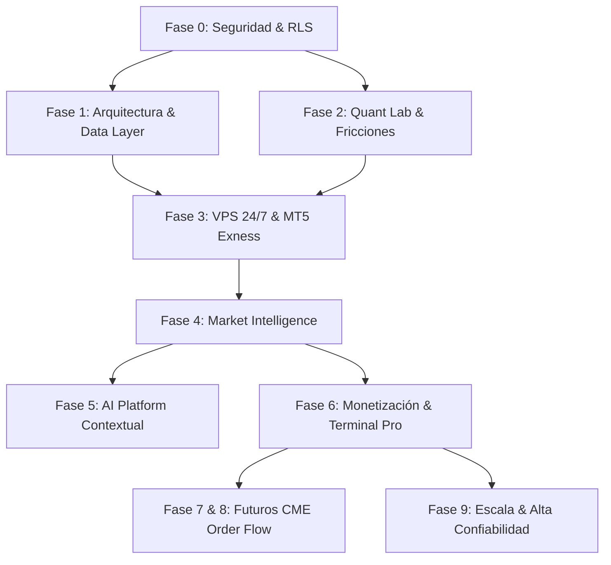

# AEON — Master Roadmap v2.0 (Recalibrado Post-Auditoría)

**Documento:** `docs/AEON_ROADMAP_V2.md`  
**Estado:** Directriz Ejecutable de Desarrollo  
**Versión:** 2.0 (Recalibrada tras Auditorías de Seguridad, Arquitectura y Cuantitativa)  
**Fecha de Publicación:** 25 de Agosto de 2026  
**Documentos de Referencia:**  
- [`docs/AEON_SECURITY_AUDIT.md`](file:///c:/Users/indatech/Desktop/Proyectos/Fintech/AEON/docs/AEON_SECURITY_AUDIT.md)  
- [`docs/AEON_TECHNICAL_AUDIT.md`](file:///c:/Users/indatech/Desktop/Proyectos/Fintech/AEON/docs/AEON_TECHNICAL_AUDIT.md)  
- [`docs/AEON_QUANT_AUDIT.md`](file:///c:/Users/indatech/Desktop/Proyectos/Fintech/AEON/docs/AEON_QUANT_AUDIT.md)  
- [`docs/CURRENT_STATE_VS_TARGET.md`](file:///c:/Users/indatech/Desktop/Proyectos/Fintech/AEON/docs/CURRENT_STATE_VS_TARGET.md)  

---

## 1. Visión General y Clasificación del Estado del Sistema

El Roadmap v2.0 reordena las prioridades técnicas del proyecto eliminando la deuda técnica acumulada, blindando la seguridad pre-producción, desacoplando la capa de datos de OANDA hacia MetaTrader 5 / Exness en VPS y sometiendo el motor cuantitativo a validación matemática rigurosa con modelado de costes reales.

### Cuadrante de Gobernanza del Código

```text
┌──────────────────────────────────────┬──────────────────────────────────────┐
│ ✅ TERMINADO (Producción-Ready)      │ 🟡 PARCIAL / DEUDA TÉCNICA           │
│ - Design System & CSS Tokens         │ - Control de Acceso Free/Pro (Bypass)│
│ - UI Terminal, Glassmorphism, Tabs   │ - Sincronización de Estados de Señal │
│ - Calendario Económico Responsive    │ - Agregación de Track Record en DB   │
│ - Proxy de Precios Live TwelveData   │ - Edge Function calendar-cleanup     │
├──────────────────────────────────────┼──────────────────────────────────────┤
│ 🛑 CONGELAR / DEPRECAR               │ 🔨 CONSTRUIR (Próximos Sprints)      │
│ - GitHub Actions como Trade Watcher  │ - Purga de Git & Rotación de Secrets │
│ - Endpoints específicos de OANDA     │ - Migraciones DDL + RLS en Postgres  │
│ - Cálculos matemáticos en Frontend   │ - DataProvider Interface (MT5/Exness)│
│ - Claims de "Order Flow" sobre CFDs  │ - WFO & Backtest con Fricción Real   │
│ - ADX N=3 sobreoptimizado            │ - Daemon 24/7 en VPS Linux           │
└──────────────────────────────────────┴──────────────────────────────────────┘
```

---

## 2. Mapa de Fases Priorizado

```text
FASE 0: Security & Pre-Production Hardening ──────► [BLOQUEANTE INMEDIATO]
  │
FASE 1: Architecture & Data Provider Layer  ──────► [DESACOPLAMIENTO OANDA]
  │
FASE 2: Quant Validation Lab (OOS & Fricción) ────► [CERTIFICACIÓN CIENTÍFICA]
  │
FASE 3: Production Quant Engine & VPS 24/7 ───────► [INFRAESTRUCTURA LIVE]
  │
FASE 4: AEON Market Intelligence & Scoring ───────► [EXPLICABILIDAD MACRO]
  │
FASE 5: AI Platform & Contextual Intelligence ────► [CAPA INTERPRETATIVA]
  │
FASE 6: AEON Pro Terminal & Monetización ─────────► [LANZAMIENTO COMERCIAL]
  │
FASE 7 & 8: Futures Intelligence (CME Order Flow) ─► [EXPANSIÓN INSTITUCIONAL]
  │
FASE 9: High Reliability & Global Scale ──────────► [ALTA DISPONIBILIDAD]
```

---

## 3. Desglose Detallado por Fases, Tareas y Criterios de Aceptación

---

### FASE 0: Security & Pre-Production Hardening (Prioridad Crítica Inmediata)

> **Objetivo:** Eliminar todas las vulnerabilidades críticas identificadas en `docs/AEON_SECURITY_AUDIT.md` antes de procesar un solo usuario real.

| Sprint | Tarea / Hito | Estado | Archivos / Componentes Afectados | Dependencias |
|---|---|:---:|---|---|
| **0.1** | **Purga de Git y Rotación de Credenciales** | 🔨 Construir | `.git/`, `.env`, Dashboard Supabase/OANDA | Ninguna |
| **0.2** | **Endurecimiento de Auth & Eliminación de Bypass Free/Pro** | 🔨 Construir | `src/js/auth.js`, `public.profiles` | Sprint 0.1 |
| **0.3** | **Infraestructura como Código (IaC): Migraciones DDL & RLS** | 🔨 Construir | `supabase/migrations/00001_initial_schema_and_rls.sql` | Sprint 0.1 |
| **0.4** | **Corrección de Seguridad en Edge Functions (`calendar-cleanup`, Proxies)** | 🔨 Construir | `supabase/functions/` | Sprint 0.1 |
| **0.5** | **Sanitización Final Frontend (`ticker.js`)** | 🔨 Construir | `src/js/templates/ticker.js` | Ninguna |

#### Criterios de Aceptación Fase 0:
1. `git log --all --full-history -- .env` retorna vacío tras purga con `git-filter-repo`.
2. Las claves de Supabase, OANDA, TwelveData y FMP han sido rotadas y no coinciden con commits antiguos.
3. Se revocó la capacidad del cliente de modificar su propio `tier` mediante trigger en `public.profiles`.
4. Todas las tablas poseen RLS habilitado y verificado mediante tests automáticos con `anon_key`.
5. `calendar-cleanup` deniega peticiones con `403 Forbidden` si el Bearer token no coincide con `SUPABASE_SERVICE_ROLE_KEY`.
6. Todas las plantillas HTML en `src/js/templates/` utilizan `escapeHTML()`.

---

### FASE 1: Architecture & Universal Data Provider Layer

> **Objetivo:** Desacoplar el frontend y el backend de proveedores específicos (OANDA), centralizar enums y migrar la lógica analítica a PostgreSQL.

| Sprint | Tarea / Hito | Estado | Archivos / Componentes Afectados | Dependencias |
|---|---|:---:|---|---|
| **1.1** | **Unificación de Enums Canónicos de Señales** | 🔨 Construir | `src/js/config/constants.js`, `src/js/templates/signal.js`, DB | Fase 0 |
| **1.2** | **Función RPC de Agregación de Track Record en Postgres** | 🔨 Construir | `src/js/services/signalService.js`, `src/js/main.js`, DB | Sprint 1.1 |
| **1.3** | **Abstracción `DataProvider` & Modelos Normalizados** | 🔨 Construir | `src/js/services/marketService.js`, `chart.js`, `Aeon_Bot` | Fase 0 |
| **1.4** | **Eliminación de Fallbacks Numéricos Sintéticos en Frontend** | 🔨 Construir | `src/js/templates/signal.js` | Sprint 1.1 |
| **1.5** | **Normalización de Señales Beat/Miss del Calendario en Backend** | 🔨 Construir | `src/js/templates/calendarItem.js`, `calendarService.js` | Fase 0 |

#### Criterios de Aceptación Fase 1:
1. El enum `SIGNAL_STATUS` (`pending`, `active`, `hit_tp1`, `closed_tp`, `closed_be`, `closed_sl`, `cancelled`) es la única fuente de verdad en base de datos, backend y UI.
2. El dashboard de Track Record consulta `rpc('get_track_record_summary')` y carga las métricas en $< 50\text{ms}$ sobre el 100% de los trades históricos.
3. El frontend utiliza únicamente símbolos canónicos (`XAUUSD`, `EURUSD`, `SPX500`) y no contiene referencias a endpoints de brokers.
4. Las plantillas de señales no contienen precios ni niveles hardcodeados de respaldo.

---

### FASE 2: Quant Validation Lab (Integridad, Fricción & Out-of-Sample)

> **Objetivo:** Recalibrar y certificar las estrategias cuantitativas sobre las 90.000 velas de Exness con deducción estricta de costes reales y validación estadística ciega.

| Sprint | Tarea / Hito | Estado | Archivos / Componentes Afectados | Dependencias |
|---|---|:---:|---|---|
| **2.1** | **Limpieza e Indexación UTC del Dataset de 90k Velas Exness** | 🔨 Construir | Dataset Exness, Scripts de Preprocesamiento | Ninguna |
| **2.2** | **Eliminación de Look-Ahead Bias: Algoritmo Developing POC y dVWAP** | 🔨 Construir | Motor Cuantitativo en Python (`Aeon_Bot`) | Sprint 2.1 |
| **2.3** | **Motor de Fricción Real (Spreads Dinámicos, Comisiones, Slippage)** | 🔨 Construir | Backtest Engine | Sprint 2.1 |
| **2.4** | **Re-calibración de Régimen (ADX $N \ge 10$) y Ponderación Estadística** | 🔨 Construir | Detector de Régimen & Scoring Module | Sprint 2.2, 2.3 |
| **2.5** | **Walk-Forward Analysis (WFO) & Simulación Monte Carlo** | 🔨 Construir | Laboratorio Cuantitativo | Sprint 2.4 |
| **2.6** | **Corrección Taxonómica en Docs: CFD Tick Volume vs Order Flow** | 🔨 Construir | `docs/AEON_Master_Plan_v2.md`, `CURRENT_STATE_VS_TARGET.md` | Ninguna |

#### Criterios de Aceptación Fase 2:
1. El cálculo de Volume Profile POC y Session VWAP es estrictamente acumulativo barra a barra ($t \le \text{current\_bar}$).
2. El backtest descuenta $\$7.00/\text{lote}$ de comisión, spread histórico y 1 pip de slippage estocástico en órdenes de salida.
3. Se elimina la anomalía del Profit Factor 1.11 idéntico, sustituyéndolo por métricas netas auditables.
4. El sistema alcanza un Profit Factor Neto $\ge 1.30$, Sharpe Ratio $\ge 1.20$ y Max Drawdown $\le 12.0\%$ en prueba Out-of-Sample.
5. El análisis Walk-Forward demuestra una eficiencia $WFE \ge 65\%$ en 10 ventanas móviles.

---

### FASE 3: Production Quant Engine & VPS 24/7 (MT5 / Exness)

> **Objetivo:** Migrar la ejecución del motor cuantitativo y del Trade Watcher de GitHub Actions a un servidor dedicado VPS Linux con conexión persistente a MetaTrader 5 de Exness.

| Sprint | Tarea / Hito | Estado | Archivos / Componentes Afectados | Dependencias |
|---|---|:---:|---|---|
| **3.1** | **Aprovisionamiento de VPS Linux & Entorno Dockerizado** | 🔨 Construir | Docker Compose, systemd, Scripts de despliegue | Fase 1 |
| **3.2** | **Conector MetaTrader 5 / Exness IPC (ZeroMQ / Python)** | 🔨 Construir | `MT5ExnessProvider` en `Aeon_Bot` | Sprint 3.1 |
| **3.3** | **Daemon Trade Watcher 24/7 con Bucle de Eventos Async** | 🔨 Construir | `TradeWatcher` Engine | Sprint 3.2, Fase 2 |
| **3.4** | **Recuperación Atómica de Estado & Reconciliación tras Reinicios** | 🔨 Construir | `TradeWatcher.recover_state()` | Sprint 3.3 |
| **3.5** | **Logging Estructurado JSON & Telemetría de Alertas Telegram** | 🔨 Construir | Módulo de Observabilidad | Sprint 3.3 |
| **3.6** | **Desconexión y Deprecación de GitHub Actions para Trading** | 🛑 Congelar | `.github/workflows/` | Sprint 3.3 |

#### Criterios de Aceptación Fase 3:
1. El Trade Watcher procesa ticks en tiempo real con latencia $< 500\text{ms}$ de forma ininterrumpida.
2. Al reiniciar el proceso o servidor, el bot reconcilia el 100% de las órdenes activas contra la base de datos sin duplicar señales ni perder el estado de Break-Even.
3. Las transiciones de estado (`ACTIVE` ➔ `HIT_TP1` ➔ `CLOSED_TP/BE/SL`) emiten eventos WebSocket a Supabase en $< 100\text{ms}$.
4. Los crons de GitHub Actions quedan limitados exclusivamente a tareas de CI/CD.

---

### FASE 4: AEON Market Intelligence & Explainable Scoring

> **Objetivo:** Consolidar el motor de inteligencia de mercado con explicabilidad macroeconómica y visualización analítica.

| Sprint | Tarea / Hito | Estado | Archivos / Componentes Afectados | Dependencias |
|---|---|:---:|---|---|
| **4.1** | **Diccionario Institucional & Agente Macro en Backend** | 🔨 Construir | Agente Macro Python / Supabase DB | Fase 3 |
| **4.2** | **Motor de Scoring Explicable (Desglose de Confluencias)** | 🔨 Construir | Generador de Señales | Fase 2 |
| **4.3** | **Visualización de Mercado Avanzada (Multi-Timeframe Charts)** | 🔨 Construir | `src/js/chart.js`, Lightweight Charts v5 | Fase 1 |
| **4.4** | **Filtros Dinámicos por Sesión (Asia, Londres, NY Killzones)** | 🔨 Construir | UI Terminal Signals | Fase 1 |

#### Criterios de Aceptación Fase 4:
1. Cada señal emitida contiene un desglose estructurado del score (Tendencia, Liquidez, Macro, Volatilidad).
2. El calendario económico se auto-sincroniza en tiempo real vía WebSockets sin intervención manual.
3. El gráfico interactivo permite alternar fluidamente entre activos institucionales con caché de 0ms.

---

### FASE 5: AI Platform & Contextual Intelligence

> **Objetivo:** Incorporar agentes analíticos de IA como capa interpretativa y contextual, subordinados al motor cuantitativo determinista.

| Sprint | Tarea / Hito | Estado | Archivos / Componentes Afectados | Dependencias |
|---|---|:---:|---|---|
| **5.1** | **Pipeline Automatizado de Daily Briefing Macro** | 🔨 Construir | Agente LLM Contextual / Supabase | Fase 4 |
| **5.2** | **Agente Analítico de Noticias y Filtrado de Sentimiento** | 🔨 Construir | `src/js/services/newsService.js` | Sprint 5.1 |
| **5.3** | **Guardrails de Seguridad: Cero Generación de Señales por IA** | 🔨 Construir | Pipeline de Inferencia | Sprint 5.1 |

#### Criterios de Aceptación Fase 5:
1. La IA no genera señales de entrada ni modifica niveles operativos; su función se limita a sintetizar contexto macro y redactar el Briefing matutino.
2. El Briefing diario se genera automáticamente a las 06:00 UTC antes de la apertura de Londres.

---

### FASE 6: AEON Pro Terminal, Monetización & Lanzamiento

> **Objetivo:** Habilitar la pasarela de pagos, gestión de suscripciones institucionales y acceso seguro a datos PRO.

| Sprint | Tarea / Hito | Estado | Archivos / Componentes Afectados | Dependencias |
|---|---|:---:|---|---|
| **6.1** | **Integración de Pasarela de Pagos (Stripe Webhooks con RLS)** | 🔨 Construir | Supabase Edge Functions / Stripe API | Fase 0, Fase 1 |
| **6.2** | **Gestión de Ciclo de Vida de Suscripción (`public.subscriptions`)** | 🔨 Construir | `src/js/perfil.js`, DB | Sprint 6.1 |
| **6.3** | **Terminal Pro UI: Alertas Push y Gestión de Riesgo Personalizada** | 🔨 Construir | Frontend SPA | Fase 4 |
| **6.4** | **Canal Privado de Telegram para Alertas PRO** | 🔨 Construir | Bot de Telegram Python | Fase 3 |

#### Criterios de Aceptación Fase 6:
1. El webhook de Stripe actualiza de forma atómica y segura el estado de suscripción sin intervención del cliente.
2. Usuarios sin suscripción activa son bloqueados por RLS en `signals_pro_data` incluso si intentan consultar directamente la API.

---

### FASES 7 & 8: Futures Intelligence & Advanced Order Flow (Futuros Centralizados)

> **Objetivo:** Expandir la plataforma hacia mercados de futuros centralizados (CME, NYMEX, Eurex) con verdadero Order Flow institucional.

| Sprint | Tarea / Hito | Estado | Archivos / Componentes Afectados | Dependencias |
|---|---|:---:|---|---|
| **7.1** | **Integración de Feed de Datos L2/L3 de Futuros (Rithmic / CQG)** | ⏳ Planificado | Conectores de Datos de Futuros | Fase 3, 6 |
| **7.2** | **Cálculo de Delta Real, CVD y Footprint Charts** | ⏳ Planificado | Motor Cuantitativo Avanzado | Sprint 7.1 |
| **7.3** | **Visualización de Heatmap de Liquidez y Depth of Market (DOM)** | ⏳ Planificado | Terminal Web Avanzado | Sprint 7.2 |

---

### FASE 9: High Reliability, Multi-Region & Global Scale

> **Objetivo:** Escalabilidad global, tolerancia a fallos y alta disponibilidad.

| Sprint | Tarea / Hito | Estado | Archivos / Componentes Afectados | Dependencias |
|---|---|:---:|---|---|
| **9.1** | **Clúster de Workers con Failover Automático** | ⏳ Planificado | Infraestructura Cloud / Docker Swarm | Fase 6 |
| **9.2** | **Monitoreo APM y Alertas de Latencia en Tiempo Real** | ⏳ Planificado | Datadog / Grafana / Prometheus | Sprint 9.1 |

---

## 4. Matriz de Dependencias Críticas



---

## 5. Resumen de Puertas de Calidad Pre-Producción (Quality Gates)

| Quality Gate | Condición Obligatoria de Aprobación | Responsable |
|---|---|:---:|
| **Gate 0 (Seguridad)** | Historial Git purgado, RLS verificado, cero bypass de `tier` en cliente. | Auditoría de Seguridad |
| **Gate 1 (Arquitectura)** | Cero dependencias directas a OANDA; RPC de Track Record activa en Postgres. | Auditoría Técnica |
| **Gate 2 (Cuantitativa)** | Profit Factor Neto $> 1.30$, Max DD $< 12\%$ con comisiones y slippage reales. | Auditoría Cuantitativa |
| **Gate 3 (Infraestructura)** | Daemon 24/7 operando en VPS Linux con MT5 Exness con latencia $< 500\text{ms}$. | DevOps / Cuantitativo |

---

> **Fin del Master Roadmap v2.0.**  
> Este documento rige el desarrollo técnico oficial y sustituye cualquier planificación anterior.
