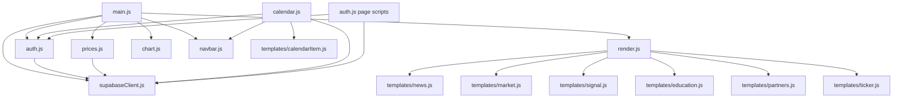

# AEON — Current State vs Target Architecture

> **Tipo:** Diagnóstico técnico completo  
> **Fecha:** 2026-08-22  
> **Autor:** Auditoría automatizada (Architect Agent)  
> **Principio rector:** Evolucionar lo existente, no reconstruir desde cero.

---

## Tabla de Contenidos

1. [Resumen Ejecutivo](#1-resumen-ejecutivo)
2. [Arquitectura Actual](#2-arquitectura-actual)
3. [Arquitectura Objetivo](#3-arquitectura-objetivo)
4. [Funcionalidades Actuales vs Objetivo](#4-funcionalidades-actuales-vs-objetivo)
5. [Qué Conservar](#5-qué-conservar)
6. [Qué Refactorizar](#6-qué-refactorizar)
7. [Qué Construir Posteriormente](#7-qué-construir-posteriormente)
8. [Deuda Técnica](#8-deuda-técnica)
9. [Riesgos](#9-riesgos)
10. [Dependencias](#10-dependencias)
11. [Prioridades](#11-prioridades)
12. [Roadmap Técnico: Phase 0 + Phase 1](#12-roadmap-técnico-phase-0--phase-1)

---

## 1. Resumen Ejecutivo

AEON es un proyecto **funcional y con identidad visual profesional clara**, que ha logrado implementar con éxito:

- Landing page con diseño premium (Glassmorphism, Dark Mode)
- Calendario económico conectado a Supabase PostgreSQL
- Autenticación de usuarios con Supabase Auth
- Sistema de señales con separación Free/Pro y Realtime
- Ticker de precios en vivo (OANDA Edge Function + CoinGecko)
- Infraestructura de deployment (Vite + Vercel)

Sin embargo, la auditoría revela **problemas de seguridad críticos** que requieren acción inmediata, deuda técnica acumulada en forma de scripts de prueba con secretos expuestos, inconsistencias en el design system CSS, y oportunidades de hardening arquitectónico antes de escalar hacia las fases avanzadas del Master Plan.

### Hallazgos Críticos de Seguridad (Acción Inmediata)

| # | Severidad | Hallazgo |
|---|-----------|----------|
| 1 | 🚨 CRÍTICA | **Supabase Service Role Key hardcodeada** en 4 archivos de test (`test_cols.mjs`, `test_join.mjs`, `test_join2.mjs`, `test_join3.mjs`). Esta clave **bypasea todo RLS** y otorga control total de la base de datos. |
| 2 | 🚨 CRÍTICA | **`.gitignore` con typo** en línea 25 (`. e n v  ` en vez de `.env`), lo que permite que `.env` se suba accidentalmente al repositorio con todas las API keys. |
| 3 | 🔴 ALTA | **`VITE_TWELVEDATA_API_KEY`** embebida en el bundle del frontend (prefijo `VITE_` la expone al navegador). |
| 4 | 🔴 ALTA | **Debug error handler** en `calendario.html` (L181-193) inyecta errores internos vía `innerHTML` directamente en el DOM de producción. |

---

## 2. Arquitectura Actual

### 2.1 Mapa de Archivos Real

```
AEON/
├── .env                          ← Credenciales (Supabase, OANDA, TwelveData)
├── .gitignore                    ← ⚠️ Bug: no ignora .env correctamente
├── package.json                  ← 3 deps runtime + 1 devDep (Vite)
├── vite.config.js                ← MPA: 4 entry points HTML
├── vercel.json                   ← Cache headers (sin security headers)
│
├── index.html                    ← Landing principal (13KB)
├── calendario.html               ← Calendario económico (10KB)
├── login.html                    ← Autenticación login
├── registro.html                 ← Autenticación registro
├── aviso-legal.html              ← Legal / Disclaimer
├── cookies.html                  ← Política de cookies
├── privacidad.html               ← Política de privacidad
│
├── append_css.cjs                ← ⚠️ Script roto (SyntaxError fatal)
├── cleanup_4d.mjs                ← Test/cleanup script (raíz)
├── setup_4d_user.mjs             ← Test setup script (raíz)
├── test_cols.mjs                 ← 🚨 Contiene Service Role Key
├── test_join.mjs                 ← 🚨 Contiene Service Role Key
├── test_join2.mjs                ← 🚨 Contiene Service Role Key
├── test_join3.mjs                ← 🚨 Contiene Service Role Key
├── test_realtime.mjs             ← Test Realtime (seguro, usa ANON_KEY)
│
├── public/
│   ├── AEON.png                  ← Logo
│   ├── favicon.svg               ← Favicon SVG
│   └── icons.svg                 ← Sprite de iconos
│
├── src/
│   ├── assets/                   ← hero.png, vite.svg, javascript.svg
│   ├── data/
│   │   └── markets.json          ← Mock data / Fallback (6.9KB)
│   ├── css/
│   │   ├── variables.css         ← Design tokens (incompletos)
│   │   ├── reset.css             ← CSS reset
│   │   ├── layout.css            ← Layout base + bg-mesh
│   │   ├── animations.css        ← Keyframes globales
│   │   ├── responsive.css        ← ⚠️ Responsive fragmentado
│   │   ├── auth.css              ← Estilos auth
│   │   └── components/           ← 12 archivos CSS por componente
│   └── js/
│       ├── supabaseClient.js     ← Singleton Supabase (7 líneas)
│       ├── auth.js               ← Login, registro, sesión, Pro check
│       ├── main.js               ← Orquestador landing (209 líneas)
│       ├── calendar.js           ← Controller calendario (262 líneas)
│       ├── chart.js              ← Hero chart TradingView LW (68 líneas)
│       ├── prices.js             ← Live pricing OANDA + CoinGecko (171 líneas)
│       ├── navbar.js             ← Mobile drawer (34 líneas)
│       ├── render.js             ← Renderizado DOM (61 líneas)
│       └── templates/            ← 7 template generators
│
├── supabase/
│   ├── config.toml               ← Config local Supabase CLI
│   └── functions/
│       └── oanda/
│           └── index.ts          ← Edge Function proxy OANDA (53 líneas)
│
└── dist/                         ← Build output (Vite)
```

### 2.2 Stack Tecnológico Actual

| Capa | Tecnología | Estado |
|------|-----------|--------|
| **Frontend** | Vanilla HTML5 + CSS3 + ES6 Modules | ✅ Funcional |
| **Bundler** | Vite (MPA mode) | ✅ Bien configurado |
| **Backend/Auth** | Supabase (PostgreSQL + Auth + Realtime + Edge Functions) | ✅ Funcional |
| **Hosting** | Vercel | ✅ Desplegado |
| **Charts** | TradingView Lightweight Charts v5 | ✅ Integrado |
| **Pricing** | OANDA v20 API (via Edge Function) + CoinGecko (directo) | ⚠️ Parcial |
| **Design** | Dark Mode, Glassmorphism, Space Grotesk + Inter | ✅ Premium |

### 2.3 Diagrama de Flujo de Datos

```
┌─────────────┐    ┌──────────────────┐    ┌──────────────────┐
│  CoinGecko  │    │  OANDA v20 API   │    │ TradingView CDN  │
│  (Directo)  │    │  (Edge Function) │    │  (Widget embed)  │
└──────┬──────┘    └────────┬─────────┘    └────────┬─────────┘
       │                    │                       │
       │   ┌────────────────┴───────────────┐       │
       │   │     Supabase Platform          │       │
       │   │  ┌──────────────────────────┐  │       │
       │   │  │ PostgreSQL               │  │       │
       │   │  │  · economic_calendar     │  │       │
       │   │  │  · signals               │  │       │
       │   │  │  · signals_pro_data      │  │       │
       │   │  │  · subscriptions         │  │       │
       │   │  │  · profiles              │  │       │
       │   │  │  · news                  │  │       │
       │   │  └──────────────────────────┘  │       │
       │   │  ┌──────────────┐ ┌─────────┐  │       │
       │   │  │ Supabase Auth│ │Realtime │  │       │
       │   │  └──────────────┘ └─────────┘  │       │
       │   └────────────────┬───────────────┘       │
       │                    │                       │
       └────────────┬───────┘                       │
                    │                               │
            ┌───────┴───────┐                       │
            │   FRONTEND    │◄──────────────────────┘
            │  (Vite MPA)   │
            │               │
            │  main.js ─────┤─── render.js ── templates/*
            │  calendar.js  │
            │  auth.js      │
            │  prices.js    │
            │  chart.js     │
            │  navbar.js    │
            └───────┬───────┘
                    │
            ┌───────┴───────┐
            │    Vercel     │
            │   (Hosting)   │
            └───────────────┘
```

---

## 3. Arquitectura Objetivo

Según el Master Plan (secciones 7-9), AEON debe evolucionar hacia:

```
                      AEON
                        │
              ┌─────────┴─────────┐
              │                   │
           FRONTEND             BACKEND
              │                   │
              │             DATA PLATFORM
              │                   │
              │       ┌───────────┼───────────┐
              │       │           │           │
              │    Macro       Markets      News
              │       │           │           │
              │       └───────────┼───────────┘
              │                   │
              │             NORMALIZATION
              │                   │
              │             ANALYTICS ENGINE
              │                   │
              │       ┌───────────┼───────────┐
              │       │           │           │
              │     Macro       Quant     Market Data
              │                   │
              │              AI PLATFORM
              │                   │
              │        ┌──────────┼──────────┐
              │        │          │          │
              │     Agents      Router     RAG
              │        │          │          │
              │        └──────────┼──────────┘
              │                   │
              └─────────────── AEON UI
```

### Gap actual → objetivo

La distancia entre la arquitectura actual y la objetivo es **significativa pero manejable**. El proyecto ha construido correctamente las capas fundamentales (Frontend, Auth, DB básica, Edge Functions). Lo que falta es principalmente las capas intermedias (Data Platform, Normalization, Analytics Engine) y las capas superiores (AI Platform, Agents, Quant Engine).

---

## 4. Funcionalidades Actuales vs Objetivo

### 4.1 Mapa de Implementación por Fase del Master Plan

| Fase | Descripción | Estado | Detalle |
|------|-------------|--------|---------|
| **Phase 0** | Auditoría y Estabilización | 🟡 En progreso | Este documento completa la auditoría. Estabilización pendiente. |
| **Phase 1** | Foundation | 🟡 Parcial | Estructura modular existe pero con deuda técnica, hardcoding y problemas de seguridad. |
| **Phase 2** | Data Platform | 🔴 No existe | No hay capa de normalización de datos. `markets.json` sigue como fuente estática. Datos de precios vienen directamente de APIs sin adaptadores. |
| **Phase 3** | Economic Calendar | 🟢 Avanzado | Tabla `economic_calendar` en Supabase, filtros por fecha/divisa, countdown de catalizador, widget DXY. Falta: historial, impact map, reacciones históricas. |
| **Phase 4** | Market Intelligence | 🟡 Básico | Market cards con precios live (OANDA 5 instrumentos + BTC). Falta: estructura de mercado, volatilidad, correlaciones, más activos. |
| **Phase 5** | Briefing | 🟡 Básico | Feed de noticias con filtros por categoría (datos de tabla `news` con fallback JSON). Falta: pipeline clasificación → relevancia → contexto → IA. |
| **Phase 6** | AI Platform | 🔴 No existe | No hay AI Router, ni agentes, ni RAG, ni integración con LLMs. |
| **Phase 7** | Quant Engine | 🔴 No existe | No hay motor cuantitativo ni cálculos estadísticos. |
| **Phase 8** | Education | 🟡 Mínimo | Cards estáticas de módulos educativos desde `markets.json`. Sin contenido real, sin quizzes, sin tutor IA. |
| **Phase 9** | AI Chat | 🔴 No existe | No hay chatbot ni sistema de intent detection. |
| **Phase 10** | Stripe + Pro | 🟡 Parcial | `checkSession` verifica `subscriptions` table con plan Pro activo. Falta: Stripe Checkout, Webhooks, tiering real. |
| **Phase 11** | Dashboard | 🔴 No existe | `dashboard.html` mencionado en README pero no existe como archivo. |
| **Phase 12+** | Futures / Order Flow | 🔴 No existe | Línea estratégica futura. |

### 4.2 Detalle de Funcionalidades Implementadas

#### ✅ Completamente Implementadas
- **Landing page premium** con Hero, Ticker, Mercados, Señales, Educación, Partners, Footer
- **Calendario económico** con datos de Supabase, filtrado por fecha y divisa, countdown de catalizador, accordion mobile
- **Autenticación** Login/Registro con Supabase Auth, gestión de sesión
- **Verificación de suscripción Pro** vía tabla `subscriptions`
- **Señales de trading** con 3 estados (público, loading Pro, locked/blur)
- **Realtime WebSocket** en señales (`signals` + `signals_pro_data`)
- **Ticker de precios en vivo** (OANDA via Edge Function, CoinGecko BTC)
- **Hero chart** Gold XAU/USD con TradingView Lightweight Charts v5
- **Mobile responsive** con drawer nav, accordion calendar, carousel mercados
- **Páginas legales** (Aviso Legal, Cookies, Privacidad)
- **Build/Deploy pipeline** (Vite → Vercel con cache headers)

#### 🟡 Parcialmente Implementadas
- **Noticias/Briefing**: Tabla `news` en Supabase + fallback JSON, filtros por categoría. Sin IA ni pipeline de clasificación.
- **Mercados**: 5 instrumentos con precios live. Sin estructura de mercado, análisis técnico, correlaciones.
- **Educación**: Cards estáticas renderizadas desde JSON. Sin contenido real.
- **Dashboard Pro**: Verificación Pro existe, UI condicional existe, pero no hay página dashboard.
- **Edge Functions**: Solo `oanda`. Sin más backend serverless.

#### 🔴 No Implementadas
- Data Platform / Capa de normalización de datos
- Data Adapters (multi-proveedor)
- AI Platform / Router / Agents / RAG
- Quant Engine
- Order Flow / Futures / Market Microstructure
- Stripe Checkout + Webhooks
- Dashboard privado completo
- AI Chat / Intent Detection
- Observabilidad / Logging estructurado
- Rate Limiting
- Content Security Policy

---

## 5. Qué Conservar

> [!IMPORTANT]
> Estos componentes están **bien construidos** y representan la base sólida de AEON. NO deben ser reemplazados ni reescritos.

### 5.1 Arquitectura y Configuración
- **Vite MPA config** (`vite.config.js`): Correcta configuración multi-page con alias `@/`.
- **Vercel deployment** (`vercel.json`): Estrategia de cache correcta (HTML sin cache, assets inmutables 1 año).
- **Supabase singleton** (`supabaseClient.js`): Patrón correcto, single point of truth.
- **Package.json minimal**: Solo 3 dependencias runtime. Excelente disciplina de dependencias.

### 5.2 Frontend / UI
- **Estética visual completa**: Glassmorphism, Dark Mode, tipografía premium (Space Grotesk + Inter + JetBrains Mono). Es de calidad profesional.
- **Navbar con frosted glass** (`navbar.css`): Apple-style blur + animated hamburger → X + accessible ARIA.
- **Ticker infinito** (`ticker.css` + `render.js`): `tabular-nums`, hover pause, GPU-accelerated.
- **Market cards mobile carousel** (`market.css`): CSS Scroll Snap, scrollbar-hidden.
- **Paywall blur overlay** (`signals.css`): Frosted glass CTA que no expone datos Pro en el DOM.
- **Skeleton shimmer loaders** (`animations.css`): Elegante efecto de carga.
- **Calendar terminal layout** (`calendar.css`): 75/25 split desktop, sticky sidebar, professional grid.
- **News category filters** con segmented tabs desktop ↔ select dropdown mobile.

### 5.3 Lógica de Negocio
- **`checkSession()` con verificación de suscripción** (`auth.js`): Query a `subscriptions` con validación temporal (`current_period_end >= now`).
- **Resilient news loading** (`main.js`): Supabase query con fallback a `markets.json`.
- **Live pricing con `Promise.allSettled`** (`prices.js`): Aislamiento de fallos entre CoinGecko y OANDA.
- **Tab visibility lifecycle** (`prices.js`): Pausa polling cuando la pestaña está en background.
- **Realtime reconnection sync** (`main.js`): Re-fetch en evento `EXTENSION`.
- **`newsCard` con HTML escaping** (`templates/news.js`): Único template con sanitización XSS correcta.
- **Signal tier separation** (`templates/signal.js`): Free tier recibe `██.███`, no datos reales.
- **`parseEcoValue`** (`calendarItem.js`): Parser robusto de valores económicos (K, M, B).
- **Live countdown < 5 min** (`calendar.js`): Pulsing timer para releases inminentes.
- **OANDA Edge Function** (`supabase/functions/oanda/index.ts`): Proxy seguro que no expone tokens al browser.
- **Auth forms** (`login.html`, `registro.html`): Zero inline styles, zero inline handlers, proper `autocomplete` attributes.

### 5.4 Design System (Base)
- **`variables.css`**: Tokens de color, tipografía, radios y easings bien estructurados.
- **`reset.css`**: Modern reset con `100dvh`, `scroll-padding-top`, `box-sizing`.
- **`layout.css`**: Container fluido con `min(1120px, 92%)`, ambient bg-mesh.
- **`buttons.css`**: Primitivas de botón con micro-interactions (`translateY(-1px)`).

---

## 6. Qué Refactorizar

> [!WARNING]
> Estos ítems requieren mejora pero **no deben ser reescritos desde cero**. Se deben refactorizar incrementalmente preservando la funcionalidad actual.

### 6.1 Seguridad (Prioridad INMEDIATA)

| Archivo | Problema | Acción |
|---------|----------|--------|
| `.gitignore` (L25) | Typo `. e n v  ` no ignora `.env` | Corregir a `.env` + `.env.*` |
| `test_cols.mjs`, `test_join*.mjs` (L6) | Service Role Key hardcodeada | Eliminar fallback key, rotar la clave en Supabase Dashboard |
| `.env` (L1) | `VITE_TWELVEDATA_API_KEY` expuesta en bundle | Mover a Edge Function backend |
| `calendario.html` (L181-193) | Debug error handler en producción | Eliminar bloque completo |
| `supabase/functions/oanda/index.ts` (L4) | CORS wildcard `*` | Restringir al dominio AEON |
| `vercel.json` | Sin security headers | Añadir `X-Content-Type-Options`, `X-Frame-Options`, `Referrer-Policy`, `CSP` |

### 6.2 Archivos de Test / Scripts (Limpieza de Raíz)

| Archivo | Acción |
|---------|--------|
| `append_css.cjs` | Eliminar (SyntaxError fatal, obsoleto) |
| `test_cols.mjs` | Eliminar o mover a `scripts/` sin key hardcodeada |
| `test_join.mjs`, `test_join2.mjs`, `test_join3.mjs` | Consolidar en uno solo en `scripts/` sin key hardcodeada |
| `test_realtime.mjs` | Mover a `scripts/` o `tests/` |
| `setup_4d_user.mjs` | Mover a `scripts/` |
| `cleanup_4d.mjs` | Mover a `scripts/` |

### 6.3 CSS Design System

| Problema | Archivos Afectados | Acción |
|----------|-------------------|--------|
| Token `--yellow` no definido (ORO indicator roto) | `variables.css`, `news.css:L179` | Añadir `--yellow: #F59E0B` a `variables.css` |
| Token `--radius` no definido | `auth.css:L69,L119` | Cambiar a `var(--radius-md)` o crear alias |
| Token `--text-main` no definido | `calendar.css:L322` | Cambiar a `var(--text)` |
| `.btn-ghost` colisión global | `buttons.css` vs `navbar.css:L81` | Renombrar navbar a `.btn-nav-ghost` |
| `.live-dot` + `@keyframes pulse-dot` duplicados | `animations.css` vs `news.css:L74-88` | Unificar en `animations.css` |
| `.eco-head-*` duplicado | `calendar.css` vs `news.css` | Extraer a componente compartido |
| `-webkit-backdrop-filter` faltante | `education.css`, `market.css`, `signals.css` | Añadir prefijo WebKit |
| `responsive.css` fragmentado | Multiple component files | Mover media queries a sus componentes respectivos |
| 4 `@media` blocks redundantes | `calendar.css` | Consolidar en uno solo |
| Breakpoints inconsistentes (640/768/899/900/1100) | Global | Estandarizar a 640/768/1024/1280 |
| Falta `@media (prefers-reduced-motion)` | `animations.css`, `ticker.css` | Añadir accesibilidad vestibular |
| CSS inline duplicado en legales | `aviso-legal.html`, `cookies.html`, `privacidad.html` | Extraer a `legal.css` |

### 6.4 JavaScript

| Problema | Archivos Afectados | Acción |
|----------|-------------------|--------|
| XSS: templates sin sanitización | `calendarItem.js`, `market.js`, `signal.js`, `education.js`, `render.js` | Crear `utils/sanitize.js` compartido y usar en todos los templates |
| IDs duplicados en ticker (DOM inválido) | `render.js:L47`, `ticker.js`, `prices.js` | Cambiar a clases CSS |
| `renderSignals` llamado 4 veces redundantemente | `main.js:L58,L70,L83,L99` | Centralizar en función única |
| Estado mutable global `globalEvents` | `calendar.js:L11` | Encapsular en closure o clase |
| `window.liveCountdownStarted` | `calendar.js:L197` | Usar estado de módulo |
| Dead code `BIAS_CLASS` | `templates/market.js:L5-9` | Eliminar |
| Dead code `syncTickerDuration` | `render.js:L14-17` | Eliminar o implementar |
| Dead code `TICKER_PX_PER_SEC` | `render.js:L12` | Eliminar |
| Inline `onclick` handlers | `index.html`, `calendario.html` | Migrar a event listeners en JS |
| `innerHTML` con `err.message` | `calendar.js:L200` | Usar `textContent` |
| Chart con datos hardcodeados | `chart.js:L8-24` | Conectar a API de precios real |
| Sin validación de env vars | `supabaseClient.js` | Añadir guard con error descriptivo |
| `supabase/config.toml` port mismatch | `config.toml:L159,L163` | Cambiar `3000` a `5173` |
| Deprecated Deno import | `oanda/index.ts:L1` | Migrar a `Deno.serve()` nativo |

### 6.5 HTML / Accesibilidad

| Problema | Archivos | Acción |
|----------|----------|--------|
| Links rotos (`/#noticias`, `/#señales`, `#`) | `calendario.html`, legales | Corregir anchors |
| Falta `aria-expanded`, `aria-controls` en menú | `index.html:L85` | Añadir atributos ARIA |
| Falta `aria-label` en select | `index.html:L138`, `calendario.html:L100,L105` | Añadir labels |
| Falta `role="alert"` en errores auth | `login.html:L28`, `registro.html:L28` | Añadir `role="alert" aria-live="assertive"` |
| Calendar table sin semántica | `calendario.html:L125-139` | Añadir ARIA grid roles |
| Favicon inconsistente | Múltiples HTML | Estandarizar a un solo favicon |
| Inline styles extensivos | `index.html`, `calendario.html` | Mover a clases CSS |
| 15 CSS `<link>` tags individuales | `index.html` | Vite los bundlea en build, pero dev experience mejora con imports en JS |

---

## 7. Qué Construir Posteriormente

> [!NOTE]
> Estos ítems corresponden a las Phases 2-12+ del Master Plan y **no deben abordarse hasta completar Phase 0 + Phase 1**.

### Phase 2: Data Platform
- `src/services/dataAdapters/` — Adaptadores por proveedor (OANDA, TwelveData, CoinGecko, futuras APIs)
- `src/services/normalization/` — Capa de normalización a modelo de datos AEON unificado
- Tablas Supabase adicionales para market data histórico normalizado

### Phase 3: Economic Calendar Avanzado
- Historial de eventos económicos y reacciones históricas
- Impact Map (evento → activos afectados)
- Contexto AI del evento

### Phase 4: Market Intelligence
- Más instrumentos (FX majors, índices globales, commodities expandidos)
- Análisis técnico básico (estructura, volatilidad, momentum)
- Correlaciones entre activos

### Phase 5: Briefing Inteligente
- Pipeline: News → Classification → Relevance → Context → AI Analysis
- AI-generated market briefings

### Phase 6: AI Platform
- AI Router multi-proveedor (OpenAI, Anthropic, Google)
- Specialized Agents (Macro, Market, News, Calendar, Education)
- RAG con datos de mercado

### Phase 7-12+: Quant Engine, Education, AI Chat, Payments, Dashboard, Futures/Order Flow

---

## 8. Deuda Técnica

### 8.1 Inventario Completo

| ID | Categoría | Severidad | Descripción | Archivos |
|----|-----------|-----------|-------------|----------|
| TD-01 | Seguridad | 🚨 Crítica | Service Role Key hardcodeada en 4 test scripts | `test_cols.mjs`, `test_join*.mjs` |
| TD-02 | Seguridad | 🚨 Crítica | `.gitignore` no protege `.env` | `.gitignore:L25` |
| TD-03 | Seguridad | 🔴 Alta | API key expuesta en frontend bundle | `.env:L1` (`VITE_TWELVEDATA_API_KEY`) |
| TD-04 | Seguridad | 🔴 Alta | Debug handler en producción | `calendario.html:L181-193` |
| TD-05 | Seguridad | 🟠 Media | CORS wildcard en Edge Function | `oanda/index.ts:L4` |
| TD-06 | Seguridad | 🟠 Media | Sin security headers en Vercel | `vercel.json` |
| TD-07 | Seguridad | 🟠 Media | XSS en 5 template generators | `calendarItem.js`, `market.js`, `signal.js`, `education.js`, `render.js` |
| TD-08 | Seguridad | 🟡 Baja | Password mínimo 6 chars (débil para fintech) | `supabase/config.toml:L182`, `registro.html` |
| TD-09 | Limpieza | 🟠 Media | 7 scripts sueltos en raíz del proyecto | Raíz del proyecto |
| TD-10 | Limpieza | 🟠 Media | `append_css.cjs` con SyntaxError fatal | `append_css.cjs` |
| TD-11 | Limpieza | 🟡 Baja | Dead code (`BIAS_CLASS`, `syncTickerDuration`, `TICKER_PX_PER_SEC`) | `market.js`, `render.js` |
| TD-12 | CSS | 🟠 Media | Tokens faltantes (`--yellow`, `--radius`, `--text-main`) | `variables.css` + consumidores |
| TD-13 | CSS | 🟠 Media | 3 colisiones de selectores globales | `btn-ghost`, `live-dot`, `pulse-dot`, `eco-head-*` |
| TD-14 | CSS | 🟡 Baja | Responsive fragmentado y breakpoints inconsistentes | `responsive.css` + componentes |
| TD-15 | CSS | 🟡 Baja | CSS inline duplicado en páginas legales | 3 HTML legales |
| TD-16 | CSS | 🟡 Baja | Falta `-webkit-backdrop-filter` en 3 componentes | `education.css`, `market.css`, `signals.css` |
| TD-17 | HTML | 🟠 Media | Inline styles y `onclick` handlers | `index.html`, `calendario.html` |
| TD-18 | HTML | 🟡 Baja | Links rotos en navegación | `calendario.html`, legales |
| TD-19 | HTML | 🟡 Baja | Accessibility gaps (ARIA, labels, roles) | Múltiples HTML |
| TD-20 | JS | 🟡 Baja | IDs DOM duplicados en ticker | `render.js:L47` |
| TD-21 | JS | 🟡 Baja | Hero chart con datos estáticos mock | `chart.js:L8-24` |
| TD-22 | Config | 🟡 Baja | Port mismatch Supabase local | `config.toml:L159,L163` |
| TD-23 | Config | 🟡 Baja | Deprecated Deno import | `oanda/index.ts:L1` |

### 8.2 Métricas de Deuda

- **Total issues identificados**: 23
- **Críticos (acción inmediata)**: 4
- **Altos**: 2
- **Medios**: 9
- **Bajos**: 8
- **Archivos afectados**: ~25 de ~40 archivos fuente

---

## 9. Riesgos

### 9.1 Riesgos de Seguridad

| Riesgo | Probabilidad | Impacto | Mitigación |
|--------|-------------|---------|------------|
| Exposición de Service Role Key en Git history | Alta | Crítico | Rotar key inmediatamente, audit Git log |
| `.env` comiteado accidentalmente | Alta | Crítico | Fix `.gitignore`, verificar Git history |
| XSS via templates sin sanitización | Media | Alto | Implementar `escape()` global |
| API key abuse (TwelveData frontend) | Media | Medio | Mover a Edge Function |
| CORS wildcard en Edge Function | Baja | Medio | Restringir origen |

### 9.2 Riesgos Arquitectónicos

| Riesgo | Probabilidad | Impacto | Mitigación |
|--------|-------------|---------|------------|
| Acoplamiento frontend a proveedores de datos (OANDA, CoinGecko directos) | Alta | Alto | Capa de Data Adapters (Phase 2) |
| Escalabilidad CSS sin tokens completos | Media | Medio | Completar design tokens en Phase 1 |
| Sin testing automatizado | Alta | Alto | Iniciar con tests E2E básicos en Phase 1 |
| Sin observabilidad ni logging | Alta | Medio | Logging mínimo estructurado en Phase 1 |
| CoinGecko rate limiting (llamada directa desde browser) | Media | Medio | Mover a Edge Function |

### 9.3 Riesgos de Negocio

| Riesgo | Probabilidad | Impacto | Mitigación |
|--------|-------------|---------|------------|
| No hay monetización implementada (Stripe) | Alta | Alto | Priorizar en Phase 10 |
| Dashboard Pro no existe | Alta | Alto | Requiere Phase 11 |
| Contenido educativo vacío | Alta | Medio | Priorizar contenido |
| markets.json aún como fuente para varios componentes | Media | Medio | Migrar a Supabase progresivamente |

---

## 10. Dependencias

### 10.1 Dependencias del Proyecto (package.json)

| Paquete | Versión | Tipo | Uso | Evaluación |
|---------|---------|------|-----|------------|
| `@supabase/supabase-js` | — | Runtime | Auth, DB, Realtime, Edge Functions | ✅ Esencial |
| `lightweight-charts` | — | Runtime | Hero chart Gold XAU/USD | ✅ Correcto |
| `dotenv` | — | Runtime* | Solo en test scripts Node | ⚠️ Debería ser devDependency |
| `vite` | — | Dev | Build tool | ✅ Esencial |

> *`dotenv` está en `dependencies` pero solo se usa en scripts de test `.mjs`, no en el frontend (Vite maneja env vars nativamente).

### 10.2 Dependencias Externas (CDN / APIs)

| Servicio | Uso | Riesgo |
|----------|-----|--------|
| Google Fonts (CDN) | Space Grotesk, Inter | Bajo (ampliamente disponible) |
| TradingView CDN | DXY widget embed | Medio (dependencia de tercero, sin SLA) |
| OANDA v20 API | Live pricing (5 instrumentos) | Medio (API practice, rate limits) |
| CoinGecko Public API | BTC price | Alto (rate limiting agresivo, sin key) |
| Supabase Cloud | Backend completo | Bajo (SLA enterprise disponible) |
| Vercel | Hosting/CDN | Bajo (SLA enterprise disponible) |

### 10.3 Dependencias Internas (Módulos JS)



---

## 11. Prioridades

### Prioridad 0: Seguridad (Inmediata — antes de cualquier otra cosa)

1. Rotar Supabase Service Role Key
2. Corregir `.gitignore`
3. Verificar Git history para secretos expuestos
4. Eliminar debug error handler de `calendario.html`
5. Mover `VITE_TWELVEDATA_API_KEY` a Edge Function

### Prioridad 1: Estabilización (Phase 0)

6. Limpiar raíz del proyecto (scripts sueltos)
7. Corregir tokens CSS faltantes
8. Resolver colisiones de selectores CSS
9. Implementar sanitización XSS en todos los templates
10. Añadir security headers en Vercel

### Prioridad 2: Foundation (Phase 1)

11. Crear `src/utils/sanitize.js` compartido
12. Crear `src/services/` layer básico
13. Normalizar responsive CSS
14. Corregir links rotos
15. Añadir ARIA accessibility
16. Mejorar error handling
17. Documentar convenciones de código

### Prioridad 3: Data Foundation (Phase 2)

18. Data Adapters
19. Normalización de datos
20. Migración de `markets.json` a Supabase

---

## 12. Roadmap Técnico: Phase 0 + Phase 1

### Phase 0 — Auditoría y Estabilización

> **Objetivo:** Resolver todos los problemas de seguridad y limpiar deuda técnica crítica sin modificar funcionalidad.

#### Sprint 0.1: Seguridad Crítica (Día 1)

| # | Tarea | Archivo(s) | Tipo |
|---|-------|-----------|------|
| 0.1.1 | Rotar Supabase Service Role Key en Dashboard | Supabase Dashboard | Config |
| 0.1.2 | Corregir `.gitignore` (L25: `.env` + `.env.*` + `!.env.example`) | `.gitignore` | Fix |
| 0.1.3 | Verificar Git history: `git log --all -p -- .env test_*.mjs` | Git | Audit |
| 0.1.4 | Crear `.env.example` con placeholders | `.env.example` [NEW] | New |
| 0.1.5 | Eliminar Service Role Key hardcodeada de test scripts | `test_cols.mjs:L6`, `test_join.mjs:L6`, `test_join2.mjs:L6`, `test_join3.mjs:L6` | Fix |
| 0.1.6 | Eliminar debug error handler producción | `calendario.html:L181-193` | Fix |
| 0.1.7 | Añadir security headers a Vercel | `vercel.json` | Fix |

#### Sprint 0.2: Limpieza de Raíz (Día 2)

| # | Tarea | Archivo(s) | Tipo |
|---|-------|-----------|------|
| 0.2.1 | Crear directorio `scripts/` | `scripts/` [NEW] | New |
| 0.2.2 | Mover scripts de test | `setup_4d_user.mjs` → `scripts/`, `cleanup_4d.mjs` → `scripts/`, `test_realtime.mjs` → `scripts/` | Move |
| 0.2.3 | Consolidar test_join scripts en uno | `test_join.mjs`, `test_join2.mjs`, `test_join3.mjs` → `scripts/test_join.mjs` | Consolidate |
| 0.2.4 | Eliminar `append_css.cjs` (SyntaxError fatal, sin uso) | `append_css.cjs` | Delete |
| 0.2.5 | Eliminar `test_cols.mjs` o mover a scripts | `test_cols.mjs` | Delete/Move |
| 0.2.6 | Mover `dotenv` a `devDependencies` | `package.json` | Fix |

#### Sprint 0.3: CSS Design System Fixes (Día 3)

| # | Tarea | Archivo(s) | Tipo |
|---|-------|-----------|------|
| 0.3.1 | Añadir tokens faltantes: `--yellow`, `--purple`, `--impact-high`, `--impact-med`, `--green-dim`, `--red-dim` | `src/css/variables.css` | Fix |
| 0.3.2 | Fix `var(--radius)` → `var(--radius-md)` | `src/css/auth.css:L69,L119` | Fix |
| 0.3.3 | Fix `var(--text-main)` → `var(--text)` | `src/css/components/calendar.css:L322` | Fix |
| 0.3.4 | Renombrar `.btn-ghost` en navbar a `.btn-nav-ghost` | `src/css/components/navbar.css:L81-89`, `index.html`, `calendario.html` | Refactor |
| 0.3.5 | Unificar `.live-dot` y `@keyframes pulse-dot` | `src/css/animations.css`, `src/css/components/news.css:L74-88` | Fix |
| 0.3.6 | Añadir `-webkit-backdrop-filter` faltante | `src/css/components/education.css`, `market.css`, `signals.css` | Fix |
| 0.3.7 | Añadir `@media (prefers-reduced-motion: reduce)` | `src/css/animations.css`, `src/css/components/ticker.css` | Accessibility |
| 0.3.8 | Eliminar clases orphaned `.mobile-menu-*` | `src/css/components/navbar.css:L231-254` | Cleanup |

#### Sprint 0.4: Seguridad Frontend (Día 4)

| # | Tarea | Archivo(s) | Tipo |
|---|-------|-----------|------|
| 0.4.1 | Crear `src/js/utils/sanitize.js` con función `escapeHTML()` | `src/js/utils/sanitize.js` [NEW] | New |
| 0.4.2 | Aplicar `escapeHTML()` en `calendarItem.js` | `src/js/templates/calendarItem.js` | Fix |
| 0.4.3 | Aplicar `escapeHTML()` en `market.js` | `src/js/templates/market.js` | Fix |
| 0.4.4 | Aplicar `escapeHTML()` en `signal.js` | `src/js/templates/signal.js` | Fix |
| 0.4.5 | Aplicar `escapeHTML()` en `education.js` | `src/js/templates/education.js` | Fix |
| 0.4.6 | Aplicar `escapeHTML()` en `render.js` (`renderPremiumFeatures`) | `src/js/render.js` | Fix |
| 0.4.7 | Validar URL schema en `partners.js` (evitar `javascript:` URIs) | `src/js/templates/partners.js` | Fix |
| 0.4.8 | Corregir `innerHTML` con `err.message` → usar `textContent` | `src/js/calendar.js:L200` | Fix |
| 0.4.9 | Restringir CORS en Edge Function OANDA | `supabase/functions/oanda/index.ts:L4` | Fix |

---

### Phase 1 — Foundation

> **Objetivo:** Convertir la arquitectura existente en una base sólida para crecer, sin reescritura masiva.

#### Sprint 1.1: Estructura y Convenciones

| # | Tarea | Archivo(s) | Tipo |
|---|-------|-----------|------|
| 1.1.1 | Crear `src/js/utils/` directory y mover `escapeHTML` (ya creado en 0.4) | `src/js/utils/` | Structure |
| 1.1.2 | Crear `src/js/services/` directory | `src/js/services/` [NEW] | Structure |
| 1.1.3 | Crear `src/js/config/` con constantes centralizadas | `src/js/config/constants.js` [NEW] | New |
| 1.1.4 | Eliminar dead code (`BIAS_CLASS`, `syncTickerDuration`, `TICKER_PX_PER_SEC`) | `src/js/templates/market.js:L5-9`, `src/js/render.js:L12,L14-17` | Cleanup |
| 1.1.5 | Crear `src/css/components/legal.css` y extraer CSS inline de legales | `src/css/components/legal.css` [NEW], `aviso-legal.html`, `cookies.html`, `privacidad.html` | Refactor |
| 1.1.6 | Documentar convenciones en `docs/CONVENTIONS.md` | `docs/CONVENTIONS.md` [NEW] | New |

#### Sprint 1.2: Mejora de Módulos JS

| # | Tarea | Archivo(s) | Tipo |
|---|-------|-----------|------|
| 1.2.1 | Añadir guard de env vars en `supabaseClient.js` | `src/js/supabaseClient.js` | Improvement |
| 1.2.2 | Consolidar `renderSignals` calls en `main.js` | `src/js/main.js` | Refactor |
| 1.2.3 | Encapsular `globalEvents` en módulo scope (eliminar `window.liveCountdownStarted`) | `src/js/calendar.js` | Refactor |
| 1.2.4 | Cambiar ticker IDs duplicados a clases CSS | `src/js/templates/ticker.js`, `src/js/prices.js`, `src/js/render.js` | Fix |
| 1.2.5 | Migrar `inline onclick` a event listeners | `index.html`, `calendario.html` | Refactor |
| 1.2.6 | Migrar Deno import a `Deno.serve()` nativo | `supabase/functions/oanda/index.ts` | Upgrade |
| 1.2.7 | Hacer instrumentos OANDA configurables (no hardcoded) | `supabase/functions/oanda/index.ts:L24` | Improvement |

#### Sprint 1.3: Mejora de HTML / Accesibilidad

| # | Tarea | Archivo(s) | Tipo |
|---|-------|-----------|------|
| 1.3.1 | Corregir links rotos de navegación | `calendario.html:L54,L56,L57`, `aviso-legal.html`, `cookies.html`, `privacidad.html` | Fix |
| 1.3.2 | Añadir ARIA attributes (`aria-expanded`, `aria-controls`, `aria-label`) | `index.html:L85,L138,L248`, `calendario.html:L100,L105` | Accessibility |
| 1.3.3 | Añadir `role="alert" aria-live="assertive"` a auth errors | `login.html:L28`, `registro.html:L28` | Accessibility |
| 1.3.4 | Estandarizar favicon across all pages | Todos los HTML | Fix |
| 1.3.5 | Mover inline styles restantes a clases CSS | `index.html`, `calendario.html` | Refactor |

#### Sprint 1.4: Mejora de Config y Observabilidad Básica

| # | Tarea | Archivo(s) | Tipo |
|---|-------|-----------|------|
| 1.4.1 | Corregir port mismatch en Supabase config | `supabase/config.toml:L159,L163` | Fix |
| 1.4.2 | Incrementar `minimum_password_length` a 8 | `supabase/config.toml:L182`, `registro.html` | Security |
| 1.4.3 | Consolidar responsive media queries en componentes | `src/css/responsive.css` → componentes individuales | Refactor |
| 1.4.4 | Crear Edge Function para TwelveData (mover de frontend) | `supabase/functions/twelvedata/index.ts` [NEW] | New |
| 1.4.5 | Mover CoinGecko calls a Edge Function | `supabase/functions/crypto/index.ts` [NEW], `src/js/prices.js` | Refactor |

---

### Resumen Visual del Roadmap

```
PHASE 0 — ESTABILIZACIÓN                    PHASE 1 — FOUNDATION
┌─────────────────────────────────┐          ┌─────────────────────────────────┐
│ Sprint 0.1: Seguridad Crítica  │──Día 1──▶│ Sprint 1.1: Estructura         │
│ Sprint 0.2: Limpieza Raíz     │──Día 2──▶│ Sprint 1.2: Módulos JS         │
│ Sprint 0.3: CSS Tokens/Fixes  │──Día 3──▶│ Sprint 1.3: HTML/Accessibility │
│ Sprint 0.4: Seguridad Frontend│──Día 4──▶│ Sprint 1.4: Config/Observ.     │
└─────────────────────────────────┘          └──────────────┬──────────────────┘
                                                            │
                                                            ▼
                                                    PHASE 2: DATA PLATFORM
                                                    (Solo después de validar
                                                     Phase 0 + Phase 1)
```

---

### Archivos Nuevos a Crear

| Archivo | Fase | Propósito |
|---------|------|-----------|
| `.env.example` | 0.1 | Template de variables de entorno |
| `scripts/` | 0.2 | Directorio para scripts de desarrollo/test |
| `src/js/utils/sanitize.js` | 0.4 | HTML escaping utility compartido |
| `src/js/config/constants.js` | 1.1 | Constantes centralizadas |
| `src/js/services/` | 1.1 | Capa de servicios |
| `src/css/components/legal.css` | 1.1 | Estilos compartidos páginas legales |
| `docs/CONVENTIONS.md` | 1.1 | Convenciones de código documentadas |
| `supabase/functions/twelvedata/index.ts` | 1.4 | Edge Function proxy TwelveData |
| `supabase/functions/crypto/index.ts` | 1.4 | Edge Function proxy crypto pricing |

### Archivos a Eliminar

| Archivo | Fase | Razón |
|---------|------|-------|
| `append_css.cjs` | 0.2 | SyntaxError fatal, obsoleto |
| `test_cols.mjs` | 0.2 | Redundante, contiene secreto hardcodeado |
| `test_join.mjs` | 0.2 | Consolidar en `scripts/test_join.mjs` |
| `test_join2.mjs` | 0.2 | Consolidar en `scripts/test_join.mjs` |
| `test_join3.mjs` | 0.2 | Consolidar en `scripts/test_join.mjs` |

---

> [!CAUTION]
> **Sprint 0.1 (Seguridad Crítica) debe ejecutarse de forma inmediata**, idealmente antes de cualquier `git push` adicional. La Service Role Key expuesta en los test scripts otorga acceso total a la base de datos bypasseando todo RLS.

---

*Este documento fue generado como resultado de la auditoría completa del repositorio AEON según las instrucciones del AEON Master Plan (sección 30) y la solicitud del Product Owner.*
