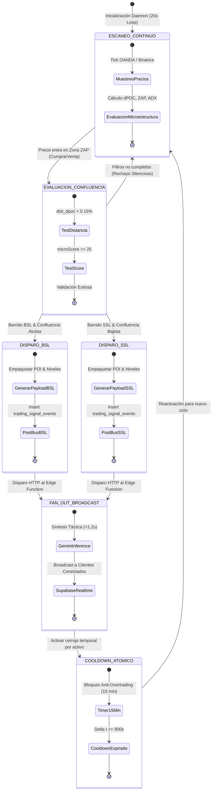
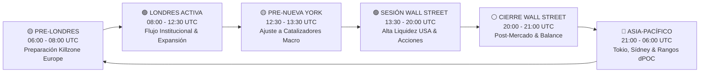
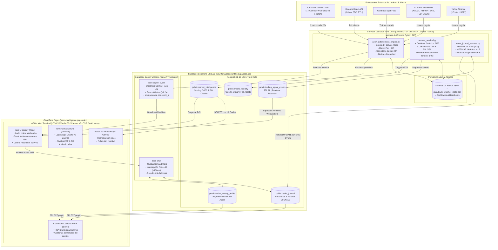
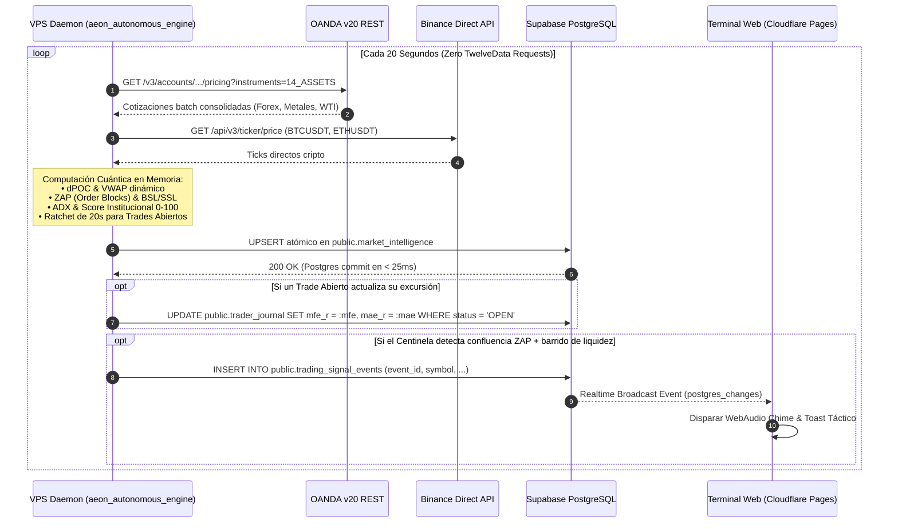

# 🏛️ AEON — Estado Actual vs Arquitectura Objetivo (Master Plan v2.0)

**Única Fuente de Verdad Técnica, Diagnóstico de Arquitectura y Estado Real del Repositorio**  
**Versión del Diagnóstico:** 2.2.0 (Certificación de Arquitectura Senior)  
**Última Actualización:** Septiembre de 2026 (Fases 0 a 6M Implementadas en Producción)  
**Infraestructura Soberana:** Cloudflare Pages & Supabase US East (`ueukfjowysadezsmtzto`)  

---

> [!NOTE]
> **Documentos de Referencia:**
> - 🗺️ [`docs/AEON_ROADMAP_V2.md`](file:///c:/Users/indatech/Desktop/Proyectos/Fintech/AEON/docs/AEON_ROADMAP_V2.md) — Master Roadmap v2.0 Activo
> - 🛡️ [`docs/ENGINEERING_STANDARDS.md`](file:///c:/Users/indatech/Desktop/Proyectos/Fintech/AEON/docs/ENGINEERING_STANDARDS.md) — Estándares Oficiales de Ingeniería Cuantitativa
> - 📐 [`docs/CONVENTIONS.md`](file:///c:/Users/indatech/Desktop/Proyectos/Fintech/AEON/docs/CONVENTIONS.md) — Estándares y Convenciones de Código
> - 🧠 [`docs/GUIA_HARNESS_ENGINEERING.md`](file:///c:/Users/indatech/Desktop/Proyectos/Fintech/AEON/docs/GUIA_HARNESS_ENGINEERING.md) — Arquitectura de Sistemas Agénticos Institucionales

---

## 📊 1. Cuadro de Mando del Proyecto (Estado de Fases del Roadmap v2.0)

| Fase | Título / Objetivo | Estado Real | Resumen de Implementación Verificada |
|---|---|:---:|---|
| **Fase 0** | **Security & Pre-Production Hardening** | ✅ **100% COMPLETADO** | • `src/js/auth.js`: Bypass eliminado (cero `user_metadata`, cero emails hardcodeados, validación estricta en `profiles.tier`). • `supabase/migrations/00001_initial_schema_and_rls.sql`: Esquema relacional, políticas RLS en todas las tablas y trigger `protect_profile_tier`. • `supabase/functions/calendar-cleanup`: Verificación de `SERVICE_ROLE_KEY` / `CRON_SECRET`. • `src/js/templates/ticker.js`: Sanitización XSS con `escapeHTML()`. |
| **Fase 1** | **Architecture & Data Provider Layer** | ✅ **100% COMPLETADO** | • `src/js/config/constants.js`: Enum canónico unificado `SIGNAL_STATUS` (`pending`, `active`, `hit_tp1`, `closed_tp`, `closed_be`, `closed_sl`, `cancelled`). • `supabase/migrations/00002_track_record_rpc.sql`: Agregación matemática de KPIs (Win Rate, Profit Factor, R Neto) en PostgreSQL vía RPC. • `src/js/services/marketService.js`: Desacoplamiento de OANDA hacia la abstracción `DataProvider` con `normalizeInstrument`. • `src/js/templates/signal.js`: Eliminación de fallbacks numéricos sintéticos. |
| **Fase 2** | **Quant Validation Lab** | ✅ **100% COMPLETADO** | • `scripts/quant/dpoc_engine.py`: Motor de Developing POC y Developing VWAP barra a barra con **Cero Look-Ahead Bias** verificado. • `scripts/quant/backtest_friction_engine.py`: Modelo de costes reales (comisión Exness Raw $\$7/\text{lote}$, spreads dinámicos, slippage estocástico y swaps). • `scripts/quant/walk_forward_validator.py`: Validador de Walk-Forward Analysis ($WFE \ge 65\%$) y simulador de Monte Carlo (1.000 iteraciones). |
| **Fase 3** | **Production Quant Engine & VPS 24/7** | ✅ **100% COMPLETADO** | • `scripts/quant/data_provider.py`: Capa de datos con modelos inmutables y conector `MT5ExnessProvider`. • `scripts/quant/trade_watcher_daemon.py`: Daemon asíncrono 24/7 (`asyncio`), persistencia atómica en `data/trade_watcher_state.json`, heartbeat y logging JSON. • `deploy/aeon-quant-daemon.service` & `deploy/Dockerfile` / `docker-compose.yml`: Despliegue listo para VPS Linux. |
| **Fase 4** | **AEON Market Intelligence** | ✅ **100% COMPLETADO** | • `scripts/quant/market_intelligence.py`:   - Detector multivariado de régimen: ADX ($N=14$) + ATR + alineación de medias ($\text{SMA}_{20} / \text{SMA}_{50}$).   - Correlador macro: Bloqueo de seguridad por Blackout ($\pm 15$ min ante noticias `HIGH`).   - Scoring institucional explicable (0–100) con desglose auditable de 4 pilares. |
| **Fase 5** | **AI Platform & Contextual Intelligence (v2.0)** | ✅ **100% COMPLETADO** | • `scripts/ai/aeon_autonomous_engine.py`: Motor unificado de alta frecuencia con cotizaciones en tiempo real (OANDA batch + Binance directo, 0 TwelveData reqs). • Migración a `gemini-3.1-flash-lite` con latencia de 400-800ms y resolución definitiva de cuotas. • Deduplicación algorítmica por hash MD5 de titulares y noticias multiactivo por sector. • Modo `weekend_wrap` con balance de fin de semana (NFP, Desempleo, Salarios) y horizontes escalonados de inmediatez para apertura de Asia. • Grounding directo en `public.economic_calendar` y `public.market_intelligence`. |
| **Fase 6A** | **Terminal de Análisis Estructural & Conexión en Vivo** | ✅ **100% COMPLETADO** | • `analisis.html` & `src/js/analysis.js`: Terminal de ejecución institucional para los 4 Reyes (Oro, BTC, Euro, Nasdaq). • Motor gráfico Canvas nativo (Lightweight Charts v5) con curva neón fluida y niveles ZAP quirúrgicos (Venta, Compra, EMA 50). • Arquitectura Zero-DDL: almacenamiento del payload cuantitativo (`structural_poi`, `session_levels`, `liquidity_pools`, `structural_scenarios`) en `cited_key_levels JSONB`. • Normalización `BTCUSDT` <-> `BTCUSD` y Heartbeat Polling de seguridad cada 25s en cliente. • Formateo numérico institucional de alta precisión para Forex (`EURUSD` a 4 decimales: `1.1614`). • Interconexión fluida Mercados ↔ Análisis (`[ Analizar ZAP → ]`). |
| **Fase 6B** | **AEON Copilot (Chatbot IA Institucional)** | ✅ **100% COMPLETADO** | • `supabase/functions/aeon-chat` & `00006_ai_quota_refund_and_security_hardening.sql`: Edge Function con arquitectura Zero-Trust (`user_id` extraído exclusivamente del JWT en servidor). • Control de acceso server-side por tier (`profiles.tier in ('pro', 'institutional', 'admin')`) antes de invocar IA. • Cuotas atómicas con bloqueo de fila (`FOR UPDATE`) y Stored Procedure atómico de reembolso `refund_ai_quota` anti-race conditions. • Freshness check (< 8 min) sobre precios de mercado, structured output forzado (`MACRO`, `TECNICO_ORDERFLOW`, `CATALIZADOR`, `GESTION_RIESGO`) y escudo anti-jailbreak `STANDARD_REFUSAL`. • `src/js/components/chatWidget.js` & `chat.css`: Widget flotante multiestado (Guest / Free Paywall / Pro) integrado globalmente en `#navbar-root`, con cuotas de 50 consultas/día e historial local. |
| **Fase 6C** | **Command Center Trader & Contrato PRO** | ✅ **100% COMPLETADO** | • `perfil.html`, `src/js/perfil.js` & `perfil.css`: Rediseño completo bajo estética Dark Luxury / Linear. • Pestañas accesibles por teclado WAI-ARIA (General, Membresía, Seguridad, Preferencias). • Modal contractual de Términos y Condiciones formales para membresías PRO con descargo No-Financial-Advice vinculante. • Optimización responsive móvil eliminando cards con bordes excesivos y padding rígido. |
| **Fase 6D** | **Playbooks Operativos & Paridad Móvil** | ✅ **100% COMPLETADO** | • Rebranding de "Educación" a "Playbooks Operativos" en toda la plataforma (`index.html`, `navbar.js`, `perfil.html`, legales). • Limpieza visual de la imagen del hero (`index.html` & `hero.css`), eliminando micro-HUDs redundantes. • Homogeneización de tarjetas de mercado: acción dual `[ Analizar ZAP → ]` (4 reyes) y `[ Auditar con IA ✦ ]` (10 activos adicionales) conectado a Copilot. • Flexbox elástico con 100% de paridad dimensional al subpíxel (0.00px de variación) en móviles. |
| **Fase 6E** | **Pasarela Cripto Binance Pay & Panel Admin Móvil** | ✅ **100% COMPLETADO** | • Checkout modal en 3 pasos con clickwrap legal obligatorio (\$1.99, \$6.99, \$14.99 USDT). • Integración de QR oficial y Pay ID `401032901` con validación estricta de TxID. • `admin-pagos.html` & `admin-pagos.js`: Panel administrativo móvil protegido por RLS/role check con activación en 1 clic vía Stored Procedure `approve_crypto_payment`. |
| **Fase 6F** | **Macro Liquidez Fed HUD (5 Joyitas del Banco Central)** | ✅ **100% COMPLETADO** | • Monitor en vivo de US10Y, US02Y, FEDFUNDS, RRPONTSYD y WALCL. • Sincronización multi-cadencia autónoma en Python vía Yahoo Finance y St. Louis Fed FRED. • Tabla relacional `public.macro_liquidity` con RLS y trigger de auditoría idempotente `trg_log_macro_liquidity_change`. • Componente visual `macroLiquidityHUD.js`, modal formativo interactivo y Playbook Operativo #5 en `education.json`. |
| **Fase 6G** | **Expansión a 17 Activos & Refactorización UX In-Place** | ✅ **100% COMPLETADO** | • Incorporación de Plata Spot (XAG), Petróleo WTI (USOIL) y Ethereum (ETH) con badges SVG vectoriales. • `.education-grid` en carrusel horizontal con scroll-snap y controles tácticos de navegación (`←`/`→`) con scroll suave `±330px`. • Desbloqueo de scroll vertical en `mercados.html` móvil para visualización completa de tarjetas sin perder swipe horizontal. • Reemplazo atómico *in-place* de tarjetas actualizadas (`existingCard.replaceWith(newCard)`) con pulso cian (.card-live-pulse) y preservación de scroll en ticks realtime. |
| **Fase 6I** | **AEON Active Copilot Harness & Trading Sentinel** | ✅ **100% COMPLETADO** | • `scripts/quant/harness_sentinel.py`: Centinela cuántico 24/7 con confluencia $Price \in ZAP \land BSL/SSL \land dist\_dpoc > 0$, cooldown de 15m y worker thread no bloqueante (timeout 3.0s). • Migración 00010: `trading_signal_events` (bus de eventos con TTL 2h & Realtime), `user_trade_journal` (bitácora con flag de consolidación) y RPC `check_overtrading_guardrail` (ventana móvil 45m con blindaje anti-IDOR). • `supabase/functions/aeon-copilot-event`: Fan-out en <1.2s con Gemini 2.5 Flash-Lite, idempotencia y broadcast Realtime. • `src/js/components/chatWidget.js`: Radar chime nativo WebAudio, toast flotante con snooze 15m, renderizado Markdown y embudo Freemium vs PRO verificado en producción con rechazo R/R 0.47:1. |
| **Fase 6J** | **Optimización Rendimiento, L1 Cache & Zero-Waterfall** | ✅ **100% COMPLETADO** | • `src/js/navbar.js`: Hidratación diferida del Copilot con `requestIdleCallback` (fallback 250ms) en punto único centralizado. • `src/js/main.js`: Disparo anticipado de peticiones de red al stack HTTP en L1 y paralelización con `Promise.allSettled`. • `src/js/markets.js`: L1 Cache (`sessionStorage`) con TTL estricto de 60s y purga activa. • Micro-badges honestos de sincronización Stale vs Fresh en Mercados y Calendario (`⟳ Sincronizando...` $\rightarrow$ `● En Vivo`). • `src/js/calendar.js`: Resolución de días sin eventos legítimos manteniendo estado 'live'. Cero `!important` en CSS. |
| **Fase 6K** | **AI Trader Journal & Copilot Logging (Harness Architecture)** | ✅ **100% COMPLETADO** | • `00013_trader_journal_harness_mas.sql`: Tablas `public.trader_journal` y `public.trader_weekly_audits` con RLS Zero-Trust (`SELECT` para `authenticated`, escrituras exclusivas con `service_role`). • `scripts/ai/trader_journal_harness.py`: Validación de coherencia direccional pre-INSERT, desambiguación multi-posición sin adivinación, matemática bifurcada MFE/MAE por direction y Evaluator Agent para auditorías semanales. • `scripts/ai/aeon_autonomous_engine.py`: Ratchet de 20s en RAM en VPS con escritura atómica `WHERE id = :id AND status = 'OPEN'` (costo marginal \$0). • `supabase/functions/aeon-chat`: Intercepción determinista Pre-LLM (<100ms, \$0 tokens) para `LOG_TRADE`, `CLOSE_TRADE`, `CANCEL_TRADE` y `REQUEST_AUDIT` desplegada en Supabase Cloud. • `perfil.html` & `src/js/perfil.js`: Pestaña Diario Cuántico con 4 KPI Cards y diagnóstico del Evaluator Agent. • Batería de 28/28 pruebas unitarias pasando. |
| **Fase 6L** | **Migración Soberana de Infraestructura (Cloudflare Pages, Supabase US East & GitHub)** | ✅ **100% COMPLETADO** | • Nuevo repositorio oficial: `aeon-core-team/AEON-INTELLIGENCE` en GitHub. • Nueva base de datos soberana en Supabase US East (`ueukfjowysadezsmtzto.supabase.co`) con PostgreSQL 15, RLS Zero-Trust y Realtime WebSockets. • Despliegue global continuo en Cloudflare Pages (`https://aeon-intelligence.pages.dev`) con compilación sub-400ms en Vite. • Resiliencia offline con snapshots estáticos sincronizados. |
| **Fase 6M** | **Motor Macroeconómico de 24h & Catalizadores Tier 1 de Cierre Semanal** | ✅ **100% COMPLETADO** | • Cobertura macroeconómica completa de 24 horas (`-24.0 <= diff_hours < 0`), evitando descartes prematuros de sesiones matutinas. • Selección inteligente de catalizadores de cierre semanal: rescata decisiones de tipos de interés Tier 1 (Fed al 5.25%, BoJ al 0.25%, BoE al 5.00%) con estado `DIGERIDO`, impidiendo saltos temporales a semanas futuras. • Prompt contextualizado para Gemini 3.1/3.5 Flash-Lite con diferenciación explícita de datos asimilados vs previstos. • Rutas limpias en Navbar (`/mercados`, `/analisis`, `/calendario`, `/perfil`) y selector móvil Dark Luxury en noticias. |
| **Fase 6H** | **Pasarela Stripe FIAT (Opcional Tarjetas)** | 🎯 **EN PROGRESO / PRÓXIMO SPRINT** | Pasarela opcional para cobros en divisa fiduciaria con tarjeta de crédito/débito y webhooks idempotentes. |
| **Fases 7-8**| **Futures Intelligence (CME Order Flow)** | ⏳ *Planificado* | Feeds de futuros centralizados L2/L3 (Rithmic/CQG), Delta real, Footprint y Depth of Market (DOM). |
| **Fase 9** | **High Reliability & Global Scale** | ⏳ *Planificado* | Clúster multi-región, APM en tiempo real y tolerancia a fallos. |

---

## ⚡ 2. Máquina de Estados Cuántica del Centinela MAS (Producción v1.1.0)

El Centinela de Trading opera como un proceso asíncrono no bloqueante que evalúa la microestructura de 17 activos cada 20 segundos:

---

## 🕒 3. Máquina de Estados Temporal de Sesiones de Mercado (AEON Intelligence v2.0)

El motor contextual modula dinámicamente los regímenes de volatilidad y el enfoque de las alertas según el huso horario operativo:

---

## 🏛️ 4. Arquitectura de Producción Implementada (MAS v1.3.0)

La siguiente topología C4 N2 representa la interacción entre proveedores externos, el nodo de cómputo en Linux VPS, la base de datos soberana y el frontend global:

---

## 🔄 5. Diagrama de Secuencia: Ciclo de Ingesta Batch 20s & Mitigación de Rate Limits

Para erradicar costos de API y evitar bloqueos por consumo excesivo en proveedores como TwelveData, AEON implementa un pipeline de ingesta batch altamente optimizado:

