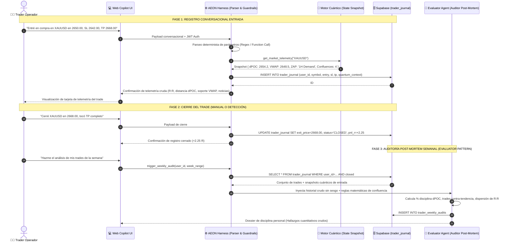

# DOSSIER TÉCNICO: AI TRADER JOURNAL & COPILOT LOGGING BAJO PRINCIPIOS DE HARNESS ENGINEERING
**Para:** Auditor Técnico Externo (Claude / Arquitecto de Sistemas Cuantitativos)  
**De:** Equipo de Desarrollo AEON  
**Fecha:** 13 de Septiembre de 2026  
**Estado:** PENDIENTE DE AUDITORÍA Y VISTO BUENO ARQUITECTÓNICO  
**Marco Teórico:** *Harness Engineering Architecture (Memoria de Largo Plazo, Verificación Externa & Guardrails por Código)*

---

## 1. Contexto Estratégico & Problema a Resolver

Tras la reciente auditoría y cancelación de la Fase 4 (eliminando cualquier integración con MT5, prop-firms o generación de "señales" predictivas), AEON se consolidó como una **Terminal Institucional de Inteligencia Cuantitativa con Harness Multi-Agente**.

El trader no busca un oráculo ni un bot de alertas de casino; busca:
1. **Contexto de alta precisión:** Datos matemáticos crudos en tiempo real (VWAP, dPOC, desviaciones $\sigma$, zonas ZAP, barridos BSL/SSL).
2. **Soberanía operativa:** El operador toma sus propias decisiones y define sus entradas.
3. **Memoria de Largo Plazo y Disciplina Cuantitativa:** Poder documentar sus ejecuciones en lenguaje natural con el Copilot de AEON a lo largo de la semana, para que el sistema audite de forma matemática y desapasionada sus aciertos, fallos y sesgos de ejecución.

### La Tesis Central del Dossier
Aplicar los 9 pilares del **Harness Engineering** al ciclo de vida del trade del usuario:
$$\text{Trader Journal Agéntico} = \text{Copilot Conversacional} + \text{Harness de Telemetría Cuántica} + \text{Memoria de Largo Plazo}$$

El LLM **no opina ni juzga** en el momento de la entrada. El **Harness**:
- Extrae parámetros cuantitativos estructurados (Símbolo, Dirección, Entrada, SL, TP).
- Congela una foto inmutable del mercado en ese instante exacto (`quantum_context_at_entry`: dPOC, distancia a VWAP, sesgo de flujo, confluencias activas).
- Al cierre de la semana, ejecuta un **Agente Auditor Evaluador** que contrasta la conducta del operador contra la evidencia empírica del mercado.

---

## 2. Topología del Sistema: El Ciclo de Vida del Trade en el Harness



---

## 3. Modelo de Datos Relacional (PostgreSQL / Supabase DDL)

Para garantizar aislamiento multi-inquilino (*tenant isolation*), integridad referencial y performance, se proponen dos tablas con políticas estrictas de **Row Level Security (RLS)**:

### 3.1 Tabla de Trades: `public.trader_journal`

```sql
-- Habilitar extensión UUID si no existe
CREATE EXTENSION IF NOT EXISTS "uuid-ossp";

CREATE TYPE trade_direction_enum AS ENUM ('BUY', 'SELL');
CREATE TYPE trade_status_enum AS ENUM ('OPEN', 'CLOSED', 'CANCELLED');
CREATE TYPE trade_exit_reason_enum AS ENUM ('TP_HIT', 'SL_HIT', 'MANUAL_EXIT', 'BREAK_EVEN', 'TIME_EXPIRY');

CREATE TABLE public.trader_journal (
    id UUID PRIMARY KEY DEFAULT gen_random_uuid(),
    user_id UUID NOT NULL REFERENCES auth.users(id) ON DELETE CASCADE,
    
    -- Metadatos del activo y orden
    symbol VARCHAR(16) NOT NULL,                    -- 'XAUUSD', 'EURUSD', 'GBPUSD', 'BTCUSD'
    direction trade_direction_enum NOT NULL,         -- 'BUY' o 'SELL'
    entry_price NUMERIC(14, 4) NOT NULL,
    stop_loss NUMERIC(14, 4) NOT NULL,
    take_profit NUMERIC(14, 4) NOT NULL,
    
    -- Métricas derivadas planificadas (Calculadas por el Harness)
    planned_risk_points NUMERIC(14, 4) GENERATED ALWAYS AS (ABS(entry_price - stop_loss)) STORED,
    planned_reward_points NUMERIC(14, 4) GENERATED ALWAYS AS (ABS(take_profit - entry_price)) STORED,
    planned_rr_ratio NUMERIC(6, 2) GENERATED ALWAYS AS (
        CASE WHEN ABS(entry_price - stop_loss) > 0 
             THEN ROUND((ABS(take_profit - entry_price) / ABS(entry_price - stop_loss))::numeric, 2)
             ELSE 0.00 END
    ) STORED,
    
    -- Telemetría Cuántica Inmutable en Timestamp de Entrada (Harness Snapshot)
    quantum_context_at_entry JSONB NOT NULL DEFAULT '{}'::jsonb,
    /* Estructura esperada de quantum_context_at_entry:
       {
         "market_price": 2650.10,
         "dpoc_price": 2654.20,
         "session_vwap": 2648.50,
         "vwap_deviation_sigma": -0.85,
         "distance_to_dpoc_pct": -0.16,
         "active_zap_zone": "1H Demand ZAP (2645-2651)",
         "mitigated_liquidity": "SSL 1H swept at 2647.80",
         "macro_sentiment": "USD_NEUTRAL",
         "upcoming_news_30m": false,
         "system_bias_score": 82
       }
    */
    
    -- Estado y Cierre
    status trade_status_enum NOT NULL DEFAULT 'OPEN',
    entry_timestamp TIMESTAMPTZ NOT NULL DEFAULT NOW(),
    exit_price NUMERIC(14, 4) NULL,
    exit_timestamp TIMESTAMPTZ NULL,
    exit_reason trade_exit_reason_enum NULL,
    
    -- Métricas Reales Obtenidas
    realized_pnl_points NUMERIC(14, 4) NULL,
    realized_rr NUMERIC(6, 2) NULL,                  -- Normalizado en múltiplos de R (+2.25R, -1.00R, 0.00R)
    
    -- Notas y Bitácora
    trader_rationale TEXT NULL,                     -- Comentarios en lenguaje natural del trader
    created_at TIMESTAMPTZ NOT NULL DEFAULT NOW(),
    updated_at TIMESTAMPTZ NOT NULL DEFAULT NOW()
);

-- Índices de consulta rápida
CREATE INDEX idx_trader_journal_user_status ON public.trader_journal(user_id, status);
CREATE INDEX idx_trader_journal_user_dates ON public.trader_journal(user_id, entry_timestamp);

-- Políticas de Seguridad RLS
ALTER TABLE public.trader_journal ENABLE ROW LEVEL SECURITY;

CREATE POLICY "Users can only read their own journal trades"
    ON public.trader_journal FOR SELECT
    TO authenticated
    USING (auth.uid() = user_id);

CREATE POLICY "Users can only insert their own journal trades"
    ON public.trader_journal FOR INSERT
    TO authenticated
    WITH CHECK (auth.uid() = user_id);

CREATE POLICY "Users can only update their own journal trades"
    ON public.trader_journal FOR UPDATE
    TO authenticated
    USING (auth.uid() = user_id)
    WITH CHECK (auth.uid() = user_id);
```

---

### 3.2 Tabla de Auditorías Semanales: `public.trader_weekly_audits`

```sql
CREATE TABLE public.trader_weekly_audits (
    id UUID PRIMARY KEY DEFAULT gen_random_uuid(),
    user_id UUID NOT NULL REFERENCES auth.users(id) ON DELETE CASCADE,
    week_start_date DATE NOT NULL,
    week_end_date DATE NOT NULL,
    
    -- Métricas Cuantitativas Agregadas
    total_trades_logged INT NOT NULL DEFAULT 0,
    winning_trades INT NOT NULL DEFAULT 0,
    losing_trades INT NOT NULL DEFAULT 0,
    breakeven_trades INT NOT NULL DEFAULT 0,
    win_rate_pct NUMERIC(5, 2) NOT NULL DEFAULT 0.00,
    net_pnl_r NUMERIC(8, 2) NOT NULL DEFAULT 0.00,
    profit_factor_rr NUMERIC(6, 2) NOT NULL DEFAULT 0.00,
    
    -- Puntuación de Disciplina Cuántica (0 a 100)
    dpoc_confluence_pct NUMERIC(5, 2) NOT NULL DEFAULT 0.00,   -- % de trades a favor del dPOC / VWAP
    risk_discipline_pct NUMERIC(5, 2) NOT NULL DEFAULT 0.00,   -- % de trades con R:R >= 1.5:1
    news_discipline_pct NUMERIC(5, 2) NOT NULL DEFAULT 0.00,   -- % de trades fuera de ventanas de noticias
    
    -- Diagnóstico Estructurado del Evaluator Agent
    audit_findings JSONB NOT NULL DEFAULT '{}'::jsonb,
    /*
       {
         "primary_failure_mode": "CHASING_EXTENSIONS_OVER_2SIGMA",
         "primary_success_mode": "NEW_YORK_OPEN_SSL_SWEEPS",
         "discipline_verdict": "Vulnerabilidad detectada en trades tomados con distancia al dPOC > 0.40%",
         "key_recommendation": "Restringir ejecuciones cuando el precio supere la banda VWAP +1.5σ."
       }
    */
    created_at TIMESTAMPTZ NOT NULL DEFAULT NOW()
);

ALTER TABLE public.trader_weekly_audits ENABLE ROW LEVEL SECURITY;

CREATE POLICY "Users can only view their own weekly audits"
    ON public.trader_weekly_audits FOR SELECT
    TO authenticated
    USING (auth.uid() = user_id);
```

---

## 4. Implementación de los Principios de Harness Engineering

### 4.1 Memoria de Largo Plazo (Long-Term Memory)
- **El Modelo es Stateless:** El LLM en el Copilot olvida cada llamada tan pronto finaliza la respuesta HTTP.
- **El Harness es Stateful:**
  - Cuando el usuario escribe en el chat, el harness consulta los últimos 5 trades abiertos de ese usuario y las métricas de la semana actual.
  - Inyecta en el system prompt un encabezado compacto:
    ```yaml
    Trader Session State:
      Active Trades: 1 (XAUUSD BUY @ 2650, PnL Unrealized: +8 pts)
      Current Week PnL: +3.5R (3 Wins, 1 Loss)
      Known Bias Tendency: Entrada prematura antes del retesteo de dPOC
    ```
  - Esto da continuidad total entre sesiones sin desperdiciar tokens cargando todo el historial.

### 4.2 Guardrails Inviolables por Código (No por Prompt)
Siguiendo la regla de oro: *"Los límites importantes viven en el sistema de permisos, no en las instrucciones"*.

1. **Anti-Advisor Middleware:**
   - Si el usuario le pregunta: *"¿Debería cerrar ya mi trade de Oro o lo dejo correr?"*
   - El modelo es forzado a responder mediante una Tool obligatoria: `format_market_risk_report()`.
   - Si el LLM intenta escribir: *"Te recomiendo cerrar ahora porque va a caer"*, el middleware en TypeScript/Python detecta patrones prescriptivos y lo reemplaza por la lectura cruda:
     > *"El precio actual (2664.50) se encuentra a 3.50 pts de tu objetivo de TP (2668.00) y enfrenta la resistencia R1 ($2665.20). La relación riesgo remanente es de 0.2:1. La decisión de gestión corresponde al operador."*

2. **Normalización Agnóstica en Múltiplos de R:**
   - AEON **nunca solicita ni almacena balance de cuenta ni lotaje en dólares**.
   - Toda la métrica se normaliza en **R (Riesgo)** y **Puntos de Mercado**.
   - Esto mantiene a AEON 100% blindado ante cualquier cuestionamiento regulatorio de prop-firms o asesores financieros.

### 4.3 Verificación Externa Determinista (Evaluator Pattern)
- Cuando el trader declara: *"Gané el trade porque mi análisis fue perfecto"*, el **Evaluator Agent** audita la evidencia objetiva:
  - ¿El trade ganó porque tocó el TP planificado, o el precio se devolvió a 2 pips del SL antes de rebotar por una noticia imprevista de la FED?
  - El Evaluator reporta los datos fríos:
    > *"El trade cerró en TP (+2.25R). Sin embargo, el drawdown máximo durante la operación fue de -0.85R debido a que la entrada se realizó con un spread de 3.2 desviaciones sobre VWAP. Eficiencia de entrada: 42/100."*

---

## 5. Casos de Uso del Copilot en Lenguaje Natural

### Caso A: Registro de Entrada
* **Usuario:** *"Entré largo en Oro en 2650 con stop en 2642 y target en 2668"*
* **Harness Acción:**
  1. Extrae: `symbol=XAUUSD`, `dir=BUY`, `entry=2650.0`, `sl=2642.0`, `tp=2668.0`.
  2. Consulta snapshot: Extrae dPOC (2654.2), VWAP (2648.5), Bias (82/100).
  3. Inserta registro en `public.trader_journal`.
* **Respuesta del Copilot:**
  ```markdown
  [TRADE REGISTRADO — ID #TJ-9102]
  • Activo: XAUUSD (BUY)
  • Entrada: 2650.00 | SL: 2642.00 (-8.00 pts) | TP: 2668.00 (+18.00 pts)
  • Ratio R:R Planificado: 2.25:1

  [TELEMETRÍA CUÁNTICA AL MOMENTO DE ENTRADA]
  • Ubicación vs. dPOC: -4.20 pts por debajo del POC diario (2654.20).
  • VWAP Sesión: 2648.50 (Entrada flotando a +1.50 pts sobre valor medio).
  • Confluencias Activas: ZAP Demanda 1H validada con barrido SSL previo en 2647.80.
  • Calendario Macro: Sin eventos de alto impacto en los próximos 60 min.
  ```

### Caso B: Cierre de Trade
* **Usuario:** *"Cerré el trade de Oro en 2668, TP alcanzado"*
* **Harness Acción:**
  1. Localiza el trade activo en `XAUUSD`.
  2. Calcula: `realized_pnl_points = +18.00`, `realized_rr = +2.25R`.
  3. Actualiza registro a `status='CLOSED'`.
* **Respuesta del Copilot:**
  ```markdown
  [TRADE FINALIZADO — ID #TJ-9102]
  • Resultado: TP ALCANZADO
  • PnL Realizado: +18.00 pts (+2.25 R)
  • Duración: 2h 14m
  • Registro archivado en tu Diario Cuántico para la auditoría de fin de semana.
  ```

### Caso C: Auditoría Post-Mortem Semanal
* **Usuario:** *"Genera mi reporte de la semana"*
* **Harness Acción:**
  1. Ejecuta `run_weekly_trader_audit`.
  2. Agrupa 8 trades de la semana (5 ganados, 3 perdidos).
* **Respuesta del Copilot:**
  ```markdown
  [AUDITORÍA CUÁNTICA SEMANAL — SEMANA 37 / 2026]
  • Trades Registrados: 8 (5 Wins | 3 Losses | Win Rate: 62.5%)
  • Retorno Acumulado: +4.85 R (Promedio Win: +2.10 R | Promedio Loss: -0.95 R)

  [ANÁLISIS DE DISCIPLINA & CONFLUENCIAS]
  • Disciplina dPOC: 87.5% (7/8 trades ejecutados a favor del valor institucional).
  • Hallazgo Crítico de Fallas: Las 3 pérdidas ocurrieron en sesiones asiáticas de bajo volumen con spread > 1.8x el promedio diario.
  • Punto Fuerte: 100% de los trades respetaron el ratio R:R mínimo de 1.5:1 sin mover el Stop Loss en contra.
  ```

---

## 6. Puntos de Decisión Sometidos a Revisión del Arquitecto

Para proceder con la fase de implementación técnica, solicitamos la revisión y dictamen del Arquitecto en los siguientes 3 aspectos:

1. **¿Detección de Salida Manual vs. Polling Asíncrono de Precios?**
   - *Opción A (Recomendada - Zero Cost & Simple):* Cierre conversacional manual (el usuario le indica al Copilot cuándo cerró o tocó TP/SL). Mantiene costos de cómputo en $0 y no requiere worker de alta frecuencia monitoreando cada tick.
   - *Opción B:* Un background worker en Python que compara el tickfeed de mercado contra los SL/TP de los trades `OPEN` en DB y marca automáticamente el trade como cerrado al ser tocado.

2. **Métricas en R vs. Unidades Monetarias:**
   - Se propone registrar exclusivamente **Puntos de Mercado y Múltiplos de R ($R:R$)**.
   - ¿Coincide el Arquitecto en que esta abstracción elimina el 100% del riesgo legal de asesoría patrimonial y previene que el trader exponga el balance privado de su cuenta?

3. **Arquitectura del Evaluator Agent:**
   - Para la auditoría semanal, ¿conviene generar un informe en Markdown directamente en el chat, o exponer un endpoint que guarde el JSON estructurado en `trader_weekly_audits` para renderizar un Dashboard visual en la pantalla `/perfil.html`?
