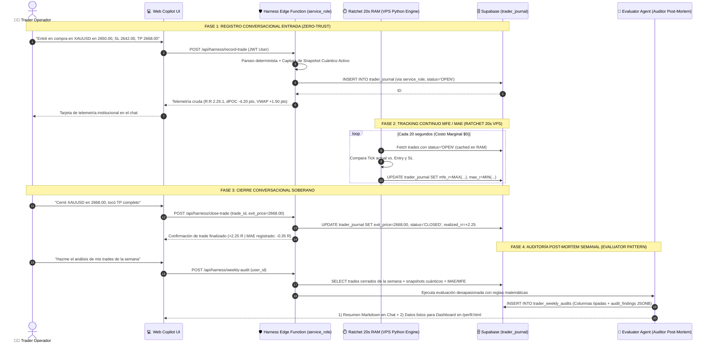

# DOSSIER TÉCNICO: AI TRADER JOURNAL & COPILOT LOGGING BAJO PRINCIPIOS DE HARNESS ENGINEERING
**Para:** Auditor Técnico Externo (Claude / Arquitecto de Sistemas Cuantitativos) & Equipo de Desarrollo AEON  
**Fecha:** 13 de Septiembre de 2026  
**Estado:** AUDITADO Y CERTIFICADO POR EL ARQUITECTO CON MODIFICACIONES DE INGENIERÍA  
**Marco Teórico:** *Harness Engineering Architecture (Memoria de Largo Plazo, Verificación Externa, Zero-Trust RLS & Guardrails por Código)*

---

## 1. Contexto Estratégico & Dictamen del Arquitecto

Tras la cancelación definitiva de la Fase 4 (eliminando integraciones con MT5, prop-firms y "señales" predictivas), AEON se consolidó como una **Terminal Institucional de Inteligencia Cuantitativa con Harness Multi-Agente**.

El trader no busca un oráculo; busca:
1. **Contexto de alta precisión:** Datos matemáticos crudos en tiempo real (VWAP, dPOC, desviaciones $\sigma$, zonas ZAP, barridos BSL/SSL).
2. **Soberanía operativa:** El operador toma sus propias decisiones de entrada y salida.
3. **Memoria de Largo Plazo y Disciplina Cuantitativa:** Poder documentar sus ejecuciones en lenguaje natural con el Copilot de AEON a lo largo de la semana, para que el sistema audite de forma matemática y desapasionada sus aciertos, fallos y sesgos de ejecución.

### 1.1 Dictamen y Correcciones Críticas del Arquitecto
En su revisión formal, el Arquitecto Técnico validó la dirección del feature e introdujo **tres correcciones de ingeniería fundamentales**:

1. **Gap Crítico Resuelto — Zero-Trust RLS (Permisos de Escritura):**
   * *Diagnóstico:* Conceder `INSERT` y `UPDATE` a `authenticated` con `WITH CHECK (auth.uid() = user_id)` permitiría que un trader manipule directamente `quantum_context_at_entry`, `realized_rr` o `system_bias_score` desde el cliente Supabase, violando la Verificación Externa Determinista.
   * *Resolución:* Revocar `INSERT`/`UPDATE` a `authenticated`. Dejar **únicamente `SELECT` con RLS**. Toda escritura se ejecuta exclusivamente a través de la Edge Function del Harness con `service_role`, garantizando que la evidencia cuántica quede **inmutable y sellada criptográficamente**.

2. **Resolución MFE/MAE — Separación de Cierre vs. Monitoreo en Tiempo Real:**
   * *Diagnóstico:* Un cierre puramente conversacional hace imposible calcular el drawdown intradiario (*MAE - Maximum Adverse Excursion*).
   * *Resolución:* **Extender el Ratchet de 20s en RAM del VPS** (ya construido en Fase 3 para alertas estructurales). Este worker en Python actualiza continuamente `mfe_r` y `mae_r` para todas las posiciones `OPEN` a costo marginal $\approx \$0$. El **cierre del trade** permanece conversacional/manual por parte del trader soberano.

3. **Superficie de Presentación Dual (Chat + Dashboard):**
   * El resumen semanal se formatea en Markdown para respuesta instantánea en el chat, y simultáneamente se almacena en `public.trader_weekly_audits` para alimentar el Dashboard histórico de evolución en `/perfil.html`.

---

## 2. Topología del Sistema: El Ciclo de Vida del Trade en el Harness



---

## 3. Modelo de Datos Relacional Certificado (PostgreSQL / Supabase DDL)

### 3.1 Tabla de Trades: `public.trader_journal`

```sql
-- Habilitar extensión UUID si no existe
CREATE EXTENSION IF NOT EXISTS "uuid-ossp";

CREATE TYPE trade_direction_enum AS ENUM ('BUY', 'SELL');
CREATE TYPE trade_status_enum AS ENUM ('OPEN', 'CLOSED', 'CANCELLED');
CREATE TYPE trade_exit_reason_enum AS ENUM ('TP_HIT', 'SL_HIT', 'MANUAL_EXIT', 'BREAK_EVEN', 'TIME_EXPIRY');

CREATE TABLE public.trader_journal (
    id UUID PRIMARY KEY DEFAULT gen_random_uuid(),
    user_id UUID NOT NULL REFERENCES auth.users(id) ON DELETE CASCADE,
    
    -- Metadatos del activo y orden
    symbol VARCHAR(16) NOT NULL,                    -- 'XAUUSD', 'EURUSD', 'GBPUSD', 'BTCUSD'
    direction trade_direction_enum NOT NULL,         -- 'BUY' o 'SELL'
    entry_price NUMERIC(14, 4) NOT NULL,
    stop_loss NUMERIC(14, 4) NOT NULL,
    take_profit NUMERIC(14, 4) NOT NULL,
    
    -- Métricas derivadas planificadas
    planned_risk_points NUMERIC(14, 4) GENERATED ALWAYS AS (ABS(entry_price - stop_loss)) STORED,
    planned_reward_points NUMERIC(14, 4) GENERATED ALWAYS AS (ABS(take_profit - entry_price)) STORED,
    planned_rr_ratio NUMERIC(6, 2) GENERATED ALWAYS AS (
        CASE WHEN ABS(entry_price - stop_loss) > 0 
             THEN ROUND((ABS(take_profit - entry_price) / ABS(entry_price - stop_loss))::numeric, 2)
             ELSE 0.00 END
    ) STORED,
    
    -- Telemetría Cuántica Inmutable en Timestamp de Entrada (Sellada por service_role)
    quantum_context_at_entry JSONB NOT NULL DEFAULT '{}'::jsonb,
    
    -- Excursión en Tiempo Real (Actualizada por el Ratchet de 20s en VPS)
    mfe_r NUMERIC(6, 2) NOT NULL DEFAULT 0.00,       -- Máxima Excursión Favorable (+R)
    mae_r NUMERIC(6, 2) NOT NULL DEFAULT 0.00,       -- Máxima Excursión Adversa (-R / Drawdown del trade)
    
    -- Estado y Cierre Soberano
    status trade_status_enum NOT NULL DEFAULT 'OPEN',
    entry_timestamp TIMESTAMPTZ NOT NULL DEFAULT NOW(),
    exit_price NUMERIC(14, 4) NULL,
    exit_timestamp TIMESTAMPTZ NULL,
    exit_reason trade_exit_reason_enum NULL,
    
    -- Métricas Reales Obtenidas
    realized_pnl_points NUMERIC(14, 4) NULL,
    realized_rr NUMERIC(6, 2) NULL,                  -- Normalizado en múltiplos de R (+2.25R, -1.00R, 0.00R)
    
    -- Notas y Bitácora
    trader_rationale TEXT NULL,
    created_at TIMESTAMPTZ NOT NULL DEFAULT NOW(),
    updated_at TIMESTAMPTZ NOT NULL DEFAULT NOW()
);

-- Índices de consulta rápida
CREATE INDEX idx_trader_journal_user_status ON public.trader_journal(user_id, status);
CREATE INDEX idx_trader_journal_user_dates ON public.trader_journal(user_id, entry_timestamp);
CREATE INDEX idx_trader_journal_open_ratchet ON public.trader_journal(symbol) WHERE status = 'OPEN';

-- Políticas de Seguridad Zero-Trust RLS (Certificadas por el Arquitecto)
ALTER TABLE public.trader_journal ENABLE ROW LEVEL SECURITY;

-- 1. Los usuarios SOLO pueden LEER sus propios registros
CREATE POLICY "Users can only read their own journal trades"
    ON public.trader_journal FOR SELECT
    TO authenticated
    USING (auth.uid() = user_id);

-- 2. INSERT y UPDATE para 'authenticated' quedan REVOCADOS.
-- Toda mutación de estado pasa EXCLUSIVAMENTE por la Edge Function del Harness con service_role.
```

---

### 3.2 Tabla de Auditorías Semanales: `public.trader_weekly_audits`

```sql
CREATE TABLE public.trader_weekly_audits (
    id UUID PRIMARY KEY DEFAULT gen_random_uuid(),
    user_id UUID NOT NULL REFERENCES auth.users(id) ON DELETE CASCADE,
    week_start_date DATE NOT NULL,
    week_end_date DATE NOT NULL,
    
    -- Métricas Cuantitativas Agregadas
    total_trades_logged INT NOT NULL DEFAULT 0,
    winning_trades INT NOT NULL DEFAULT 0,
    losing_trades INT NOT NULL DEFAULT 0,
    breakeven_trades INT NOT NULL DEFAULT 0,
    win_rate_pct NUMERIC(5, 2) NOT NULL DEFAULT 0.00,
    net_pnl_r NUMERIC(8, 2) NOT NULL DEFAULT 0.00,
    profit_factor_rr NUMERIC(6, 2) NOT NULL DEFAULT 0.00,
    average_mae_r NUMERIC(6, 2) NOT NULL DEFAULT 0.00,         -- Drawdown promedio sufrido
    average_mfe_r NUMERIC(6, 2) NOT NULL DEFAULT 0.00,         -- Excursión favorable promedio
    
    -- Puntuación de Disciplina Cuántica (0 a 100)
    dpoc_confluence_pct NUMERIC(5, 2) NOT NULL DEFAULT 0.00,   -- % de trades confluentes con dPOC / VWAP
    risk_discipline_pct NUMERIC(5, 2) NOT NULL DEFAULT 0.00,   -- % de trades con R:R >= 1.5:1
    news_discipline_pct NUMERIC(5, 2) NOT NULL DEFAULT 0.00,   -- % de trades fuera de ventanas macro
    
    -- Diagnóstico Estructurado del Evaluator Agent
    audit_findings JSONB NOT NULL DEFAULT '{}'::jsonb,
    created_at TIMESTAMPTZ NOT NULL DEFAULT NOW()
);

ALTER TABLE public.trader_weekly_audits ENABLE ROW LEVEL SECURITY;

CREATE POLICY "Users can only view their own weekly audits"
    ON public.trader_weekly_audits FOR SELECT
    TO authenticated
    USING (auth.uid() = user_id);
```

---

## 4. Guardrails Inviolables & Anti-Advisor Middleware

Siguiendo la instrucción explícita del Arquitecto:
1. **Restricción a Nivel de Esquema:** El LLM no genera texto libre prescriptivo; responde invocando la tool obligatoria `format_market_risk_report()`.
2. **Denylist Secundario en Texto Libre:** Sobre cualquier campo descriptivo libre que quede dentro de la Tool, se aplica un middleware regex que intercepta palabras clave de asesoría ("te recomiendo", "deberías cerrar", "compra aquí", "duplica el lote") y las reemplaza por lecturas neutrales de microestructura.
3. **Normalización en $R$:** Protege los datos privados del trader y elimina cualquier indicio de custodia o administración de fondos de terceros.

---

## 5. Próximos Pasos para la Construcción

Con el visto bueno y las 3 correcciones de arquitectura ya incorporadas, la ruta de implementación consiste en:
1. **Migración SQL en Supabase:** Creación de `trader_journal` y `trader_weekly_audits` con RLS de solo lectura para `authenticated`.
2. **Harness Edge Function (`aeon-journal`):** Endpoints con `service_role` para `record_trade`, `close_trade` y `weekly_audit`.
3. **Worker Ratchet de 20s en VPS (`aeon_autonomous_engine.py`):** Ampliar el bucle en RAM para computar `mfe_r` y `mae_r` en trades `OPEN`.
4. **Copilot UI & Dashboard:** Integración del flujo conversacional en el chat y visualización de la evolución de disciplina en `/perfil.html`.
