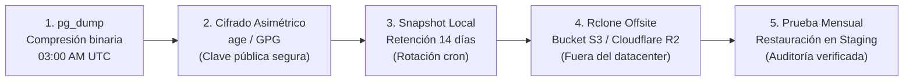
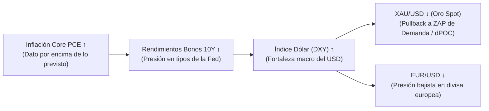

# 🛡️ AEON — Estándares de Ingeniería de Software Profesional & Infraestructura

**Documento:** `docs/ENGINEERING_STANDARDS.md`  
**Estado:** Directriz Oficial de Arquitectura, Modelado Cuantitativo y Buenas Prácticas  
**Versión:** 2.2.0 (Certificación de Ingeniería Senior)  
**Fecha de Aprobación:** Septiembre de 2026  
**Ámbito de Aplicación:** Servidores VPS, Algoritmos Cuantitativos, Bases de Datos Supabase y Terminal Web  

---

> [!NOTE]
> **Documentos Relacionados:**  
> - 🗺️ [`docs/AEON_ROADMAP_V2.md`](file:///c:/Users/indatech/Desktop/Proyectos/Fintech/AEON/docs/AEON_ROADMAP_V2.md) — Master Roadmap v2.0 Activo  
> - 📐 [`docs/CONVENTIONS.md`](file:///c:/Users/indatech/Desktop/Proyectos/Fintech/AEON/docs/CONVENTIONS.md) — Convenciones y Estándares de Código  
> - 📋 [`docs/CURRENT_STATE_VS_TARGET.md`](file:///c:/Users/indatech/Desktop/Proyectos/Fintech/AEON/docs/CURRENT_STATE_VS_TARGET.md) — Topología de Red y Arquitectura C4  
> - 🧠 [`docs/GUIA_HARNESS_ENGINEERING.md`](file:///c:/Users/indatech/Desktop/Proyectos/Fintech/AEON/docs/GUIA_HARNESS_ENGINEERING.md) — Arquitectura de Sistemas Agénticos  

---

## 🏛️ 1. Filosofía: Vibe Coding con Rigor de Ingeniería Senior

El desarrollo ágil asistido por Inteligencia Artificial (*vibe coding*) permite acelerar la construcción de interfaces y flujos de usuario, pero **en fintech y trading cuantitativo los fallos de lógica, aritmética o concurrencia conllevan pérdidas directas de capital**.

> *"El límite del vibe coding aparece donde la deuda técnica oculta se vuelve fatal: los núcleos matemáticos, bases de datos relacionales y sistemas financieros exigen invariantes formales y cero parches ciegos."*

AEON opera bajo una estricta política de **Quality Gates (Barreras de Calidad)**:
1. **Cero Deuda Técnica Oculta:** Ninguna función crítica pasa a producción sin validación estricta de tipos, sanitización XSS y tests deterministas.
2. **Build Ultra-Rápido & Determinista:** Compilación Vite obligatoria en tiempo inferior a 400ms ($t_{\text{build}} < 400\text{ms}$).
3. **Seguridad Zero-Trust:** Todo acceso a datos sensibles se resuelve a nivel de fila mediante Row-Level Security (RLS) en Supabase PostgreSQL.

---

## 💳 2. Arquitectura de Pagos Idempotente & Transactional Outbox (Fase 6)

Para el sistema de monetización, recargas cripto y suscripciones PRO:

### A. Claves de Idempotencia (`Idempotency-Key`)
* Toda solicitud de cobro, webhook de Stripe o confirmación de Binance Pay debe registrar un identificador único en base de datos (`event_id` o `txid`).
* Ante reintentos de red o caídas temporales, el endpoint verifica atómicamente si el evento ya fue procesado antes de mutar la base de datos, **garantizando que ningún usuario sea cobrado dos veces ni se dupliquen suscripciones**.

### B. Patrón Transactional Outbox


> [!TIP]
> **Principio de Desacoplamiento:** Los servicios externos (proveedores de correo, notificaciones push, webhooks de terceros) son efectos secundarios y **nunca deben bloquear la transacción principal de la base de datos**. Si el servicio de correo falla, el pago queda confirmado con éxito y el worker reintenta el envío en segundo plano.

---

## 🛡️ 3. Hardening y Seguridad Militar para el Servidor VPS Linux

Para la infraestructura de trading 24/7 en Linux (Ubuntu 24.04 LTS / LD4 Londres / Local):

### A. Configuración Estricta de SSH (`/etc/ssh/sshd_config`)
```bash
PermitRootLogin no
PasswordAuthentication no
PubkeyAuthentication yes
MaxAuthTries 3
AllowUsers aeon_operator
```

### B. Defensa en Profundidad & Prevención de Intrusiones
1. **Firewall UFW / Whitelist de IP:** Exponer exclusivamente los puertos estrictamente necesarios (SSH en puerto no estándar).
2. **`fail2ban`:** Baneo dinámico de direcciones IP ante 3 intentos fallidos de autenticación.
3. **Aislamiento de Procesos en Docker:** Los daemons de AEON (`aeon_autonomous_engine.py`, `harness_sentinel.py`, `trader_journal_harness.py`) corren en contenedores independientes orquestados vía `docker-compose.yml`. El colapso de un proceso no impacta la disponibilidad del resto.

### C. Pipeline de Respaldo Cifrado 3-2-1 Offsite



> [!CAUTION]
> *"Un backup que nunca se ha restaurado no es un backup, es un acto de fe."*  
> Se programa una prueba obligatoria mensual de restauración en un entorno de pruebas aislado para validar la integridad de los volcados.

---

## 🗄️ 4. Escalabilidad de Base de Datos para Carga 95% Lecturas

Una terminal financiera opera con una proporción de **95% lecturas y 5% escrituras**. La base de datos se diseña para responder a esta asimetría:

### A. Agregaciones en Servidor vía RPC
* Cero procesamiento pesado en el cliente web: métricas de Track Record, Win Rate y R Neto se calculan en PostgreSQL mediante funciones RPC compiladas (`get_track_record_summary`) con tiempo de ejecución $< 50\text{ms}$.

### B. Eliminación Perezosa (Lazy Deletion) & Limpieza por TTL
* En lugar de ejecutar comandos `DELETE` masivos que bloqueen índices en tablas de alta concurrencia (como `trading_signal_events` o `news`), se utiliza filtrado por expiración:
  ```sql
  SELECT * FROM public.news WHERE created_at >= NOW() - INTERVAL '48 hours';
  ```
* La depuración física se ejecuta en horarios de baja volatilidad mediante tareas programadas vía pg_cron.

### C. Optimización de Conteos
* Se prohíbe el uso de `SELECT COUNT(*)` secuencial en tablas con millones de registros; se utilizan estimaciones rápidas de metadatos (`pg_class.reltuples`) o contadores materializados.

---

## 🧠 5. Inteligencia de Mercado basada en Grafos de Contexto

El módulo **AEON Intelligence** trasciende el paradigma de chatbot conversacional para actuar como un **grafo de conocimiento causal estructurado**:



* La IA opera con **Grounding Estricto** (`temperature = 0.1` y esquemas JSON garantizados), impidiendo la invención o alucinación de cotizaciones no respaldadas por el libro de órdenes.

---

## 📊 6. Protocolo Oficial de Certificación Cuantitativa (Estándar de Riesgo Sonnet)

Ningún algoritmo cuantitativo se promueve al estado de producción ni se activa en las alertas tácticas sin haber superado **todos y cada uno** de los siguientes umbrales:

### A. Matriz Oficial de Quality Gates

| Métrica Cuantitativa | Definición Formal ($\KaTeX$) | Umbral Mínimo Exigido | Verificación de Auditoría |
|---|---|:---:|:---:|
| **Periodo de Datos** | $\Delta t \ge 1 \text{ Año}$ continuo ($N \ge 5.000\text{ velas H1}$) | $\ge 5.000\text{ velas}$ | Determinista Out-of-Sample |
| **Fricción de Broker** | Costes reales Exness Raw (\$7/lote + spread + swap) | Spread dinámico | Simulación de Ejecución |
| **Look-Ahead Bias** | Fuga de información temporal barra actual/futura | **0.00%** | Unit Test barra a barra |
| **Profit Factor (PF)** | $$PF = \frac{\sum \text{Ganancias Brutas}}{\sum \|\text{Pérdidas Brutas}\|} \ge 1.35$$ | $\ge 1.35$ | 1 Año OOS |
| **Sharpe Ratio** | $$SR = \frac{\mathbb{E}[R_p - R_f]}{\sigma_p} \cdot \sqrt{252} \ge 1.30$$ | $\ge 1.30$ | Anualizado continuo |
| **Maximum Drawdown** | $$DD_{\text{max}} = \max_{t \in [0, T]} \left( \frac{\text{HWM}_t - \text{Equity}_t}{\text{HWM}_t} \right) \le 12.0\%$$ | $\le 12.0\%$ | Simulación Monte Carlo (1.000 iteraciones) |
| **Walk-Forward Efficiency** | $$WFE = \frac{\text{Annualized Return}_{\text{OOS}}}{\text{Annualized Return}_{\text{IS}}} \ge 65.0\%$$ | $\ge 65.0\%$ | 10 Ventanas Deslizantes |
| **Modo Sombra (Shadow)** | Telemetría en VPS sin emisión de trades en vivo | 14 días corridos | Registro de Ticks en RAM |

---

### B. Algoritmo de Ratchet en RAM de 20s para MAE / MFE

Para cuantificar con precisión matemática la calidad de entrada y el sesgo emocional del operador en el **AI Trader Journal**:

1. **Riesgo Planificado en Puntos:**
   $$\text{Planned Risk Points} = |\text{Entry Price} - \text{Stop Loss}|$$

2. **Maximum Favorable Excursion Normalizada ($MFE_R$):**
   $$\text{MFE}_R = \frac{|\text{Best Price Reached} - \text{Entry Price}|}{\text{Planned Risk Points}}$$

3. **Maximum Adverse Excursion Normalizada ($MAE_R$):**
   $$\text{MAE}_R = \frac{|\text{Entry Price} - \text{Worst Price Suffered}|}{\text{Planned Risk Points}}$$

4. **Ratio R Realizado al Cierre:**
   $$\text{Realized } R = \frac{\text{Realized PnL Points}}{\text{Planned Risk Points}}$$

> [!WARNING]
> Si durante la vida del trade $\text{MAE}_R > 1.0$, significa que el precio perforó el Stop Loss planificado. Si la posición no fue liquidada en ese punto, el sistema clasifica automáticamente la operación como **violación de disciplina por indisciplina operativa**.

---

### C. Universo Core de 4 Reyes para Investigación Profunda
1. **`XAUUSD` (Oro Spot):** Foco en absorción de volumen institucional y retrocesos a dPOC en Killzones Londres y Nueva York.
2. **`NAS100` (Nasdaq 100):** Foco en expansión de volatilidad, momentum en apertura de Wall Street y rupturas de bandas VWAP con $ADX > 25$.
3. **`EURUSD` (Euro/Dólar):** Foco en reversión a la media macro en temporalidades H1/H4 con ratios planificados $R \ge 2.5R$ para absorber holgadamente la comisión de \$7/lote.
4. **`BTCUSD` (Bitcoin):** Foco en barridos de liquidez institucional (BSL/SSL) y anomalías extremas de dispersión Z-Score con objetivos mínimos $\ge 1:3.5R$.

> [!CAUTION]
> **Exclusión Definitiva:** Los pares `GBPUSD` y `SPX500` quedan permanentemente descartados del motor de cálculo cuantitativo por redundancia de correlación ($r > 0.85$ con EURUSD y $r > 0.90$ con NAS100) y dispersión ineficiente de liquidez.

---

## 📑 7. Resumen de Calidad para el Equipo de Desarrollo

| Área | Estándar Obligatorio | Verificación Automatizada |
|---|---|:---:|
| **Frontend** | Single Source of Truth (`constants.js`), Cero Hardcode, Sanitización XSS (`escapeHTML`). | Build Vite $< 400\text{ms}$ |
| **Backend / DB** | RLS Zero-Trust en 100% de tablas, Procedimientos RPC indexados, Idempotencia. | Migraciones SQL Versionadas |
| **VPS / Infra** | SSH endurecido con llave, `fail2ban`, Docker aislado, Backups cifrados con age. | Healthcheck cada 20s |
| **Trading Core** | Certificación de 1 año con costes reales Exness, WFO en 10 ventanas. | $PF \ge 1.35, SR \ge 1.30, DD \le 12\%$ |
| **Legal / Compliance** | Consentimiento explícito de Términos PRO, cláusula No-Financial-Advice estricta. | Modal Contractual Vinculante |

---

## ⚖️ 8. Gobernanza Legal, Cumplimiento y Blindaje Contractual PRO

### A. Cláusula Estricta de No Asesoramiento Financiero (*No Financial Advice - NFA*)
* Ningún componente de la plataforma (incluyendo el análisis estructural ZAP, el escáner de sesgos de mercado, las confluencias de Order Flow y las respuestas del **AEON Copilot**) constituye ni debe interpretarse como asesoramiento financiero personalizado, recomendación de inversión ni gestión delegada de capital.
* Todo trader asume la responsabilidad total y exclusiva de sus decisiones operativas y gestión de riesgo en su broker o cuenta de fondeo.

### B. Protocolo de Aceptación Contractual para Membresías PRO
1. **Consentimiento Previo Vinculante:** Antes de completar el upgrade a cualquier modalidad PRO o Institucional, el usuario debe visualizar y aceptar formalmente los Términos y Condiciones Contractuales de AEON Intelligence.
2. **Registro de Auditoría en Base de Datos:**
   * La aceptación queda registrada con marca de tiempo UTC (`terms_accepted_at`), versión del contrato (`terms_version`) y dirección IP / User-Agent en el perfil del usuario (`public.profiles`).
3. **Modal de Consulta Permanente:** El contrato íntegro permanece accesible en todo momento dentro del Command Center del Trader ([`perfil.html`](file:///c:/Users/indatech/Desktop/Proyectos/Fintech/AEON/perfil.html)) bajo la pestaña *Membresía*, garantizando transparencia total.
