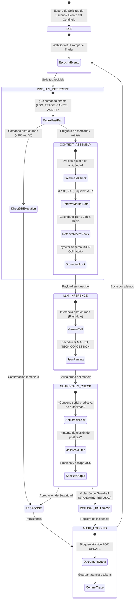
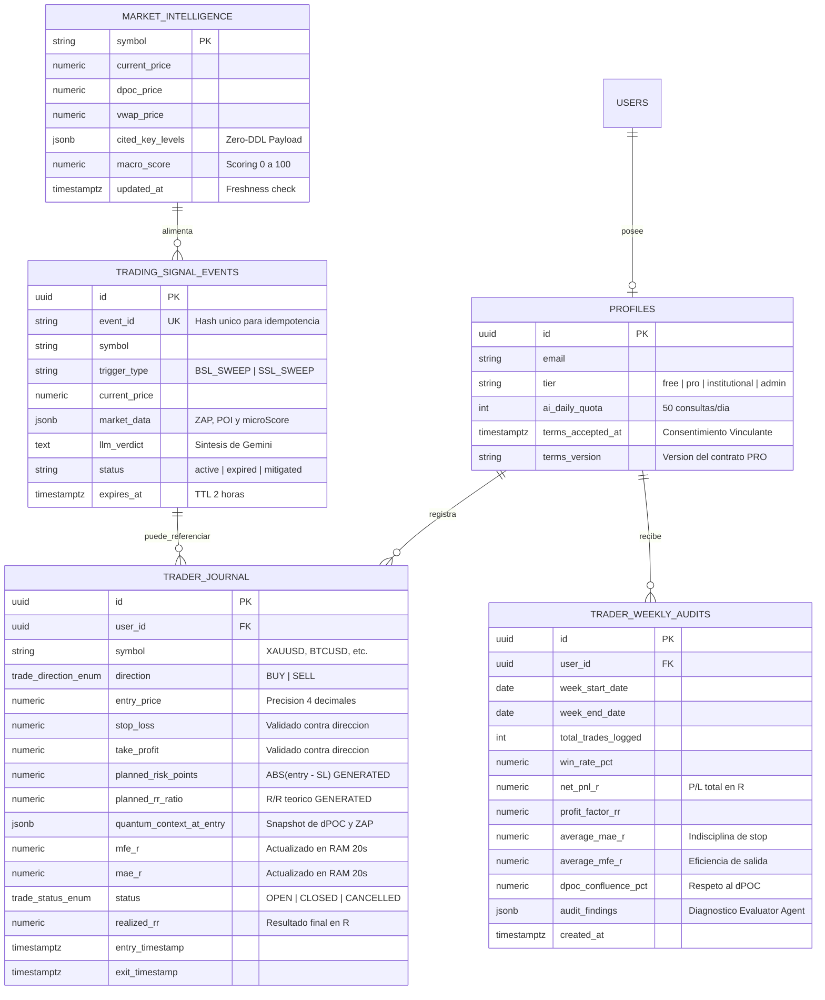
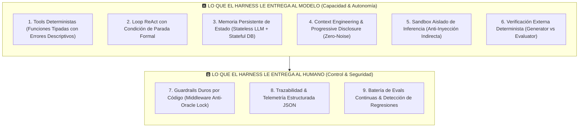
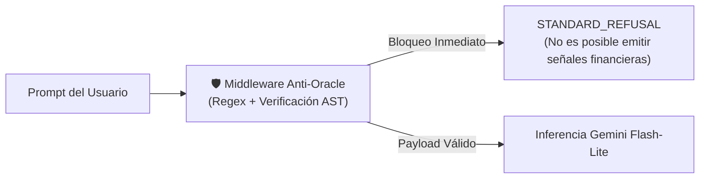

# 🧠 AEON — Guía de Harness Engineering: Arquitectura de Sistemas Agénticos Institucionales

**Documento:** `docs/GUIA_HARNESS_ENGINEERING.md`  
**Estado:** Especificación Técnica Normativa de Sistemas Agénticos  
**Versión:** 2.2.0 (Certificación de Ingeniería Senior)  
**Fecha de Aprobación:** Septiembre de 2026  
**Ámbito de Aplicación:** AEON Copilot, Sentinel Daemon, Evaluator Agent y Trading Journal  

---

> *"Un modelo recibe texto y devuelve texto. Eso es todo lo que hace. No abre archivos, no ejecuta órdenes, no calcula matemáticas en tiempo real ni tiene memoria de estado. Todo lo que no es el modelo, es el **Harness**."*

---

## 🏛️ 1. La Tesis Fundamental: Modelo vs. Harness

Durante mucho tiempo se asumió erróneamente que para mejorar el desempeño de un sistema de Inteligencia Artificial la única solución era cambiar de LLM o refinar el prompt (*Prompt Engineering*). La ingeniería de software contemporánea (Anthropic, OpenAI, DeepMind) ha demostrado formalmente lo contrario:

$$\text{Agente Cuantitativo} = \text{Modelo de Lenguaje (LLM)} + \text{Harness de Ingeniería}$$

* **El Modelo (Inferencia & Razonamiento):** Actúa como el procesador central (CPU). Es intrínsecamente *stateless* (sin estado propio), incapaz de interactuar con el mundo físico, bases de datos o feeds de mercado por sí mismo.
* **El Harness (El Arnés / Sistema Operativo Agéntico):** Es todo el software determinista que rodea al modelo: recopila y filtra el contexto táctico, expone contratos de herramientas (*tools*), ejecuta acciones, administra la memoria persistente en PostgreSQL, impone guardrails de seguridad por código, verifica resultados contra evidencia empírica externa y audita las trazas de ejecución.

$$\text{SNR}_{\text{context}} = \frac{\text{Tokens de Evidencia Táctica Relevante (dPOC, ZAP, ATR, Calendario)}}{\text{Tokens Totales Inyectados en la Ventana de Atención}}$$

> [!NOTE]
> Un modelo ligero de alta velocidad (como Gemini 3.1 Flash-Lite) dotado de un **Harness de ingeniería superior** supera consistentemente en precisión, latencia y costo operativo a un modelo masivo de frontera montado sobre un arnés deficiente o no estructurado.

---

## 🔄 2. Ciclo de Vida ReAct del Copilot & Evaluator Agent

El motor agéntico de AEON no ejecuta inferencias a ciegas. Opera bajo un bucle determinista de estados finitos que valida cada interacción antes y después de consultar al modelo:



---

## 🗄️ 3. Modelo de Datos del Harness en Supabase (ERD de Producción)

El siguiente diagrama entidad-relación refleja con precisión las tablas relacionales y vínculos gobernados por el arnés en Supabase PostgreSQL:



---

## 🧱 4. Los 9 Bloques Fundamentales de un Harness Institucional

Un arnés agéntico se estructura en **dos dimensiones complementarias**: la dimensión funcional (lo que el harness le proporciona al modelo) y la dimensión de gobernanza (lo que le proporciona al operador humano):



---

### Dimensión A: Lo que el Harness le Proporciona al Modelo

#### 1. Tools con Errores Informativos y Remediales
* Toda *tool* cuenta con tipado estricto y descripciones semánticas que delimitan su ámbito.
* **Regla de Oro:** Un error devuelto por una herramienta nunca debe ser un código genérico (`{"status": "error"}`). Debe incluir el motivo del fallo y parámetros de ajuste válidos:
  ```json
  {
    "status": "rejected",
    "reason": "Stop Loss (2655.00) está por encima del precio de entrada (2650.00) en una orden BUY",
    "remediation": "Para órdenes BUY, el Stop Loss debe ser estrictamente menor que entry_price"
  }
  ```

#### 2. Loop Dinámico de Ejecución (Patrón ReAct)
* El agente avanza mediante iteraciones: **Pensamiento $\rightarrow$ Invocación de Tool $\rightarrow$ Observación del Entorno $\rightarrow$ Refinamiento**.
* Límite estricto de seguridad: Techado a un máximo de 3 pasos por consulta para evitar bucles infinitos de consumo de tokens.

#### 3. Memoria de Estado y Desambiguación Atómica
* El modelo no retiene memoria entre llamadas HTTP. El harness reconstruye el contexto activo:
  * Si el trader escribe `"cierra la posición"`, el harness consulta en PostgreSQL cuántas posiciones tiene abiertas:
    * Si hay 1 posición: Ejecuta el cierre atómico de forma transparente.
    * Si hay múltiples posiciones: Solicita desambiguación explícita antes de mutar la base de datos sin adivinar.

#### 4. Context Engineering & Progressive Disclosure
* Inyectar grandes volúmenes de datos históricos degrada la atención (*Lost in the Middle*).
* El harness entrega resúmenes tácticos estructurados y permite que el modelo solicite detalles de mayor granularidad solo si el usuario lo requiere.

#### 5. Sandbox de Inferencia & Anti-Prompt Injection
* Los textos provenientes de noticias de mercado o feeds RSS externos son sanitizados y aislados antes de ser suministrados al LLM, neutralizando ataques de inyección indirecta de instrucciones.

#### 6. Verificación Externa (Generator vs. Evaluator)
* El agente que formula una hipótesis de mercado nunca es quien la audita.
* Un **Evaluator Agent** independiente revisa semanalmente el diario del trader confrontando las entradas registradas contra el historial real de ticks y el dPOC de cada sesión.

---

### Dimensión B: Lo que el Harness le Proporciona al Operador Humano

#### 7. Permisos & Guardrails Duros por Código
* Los límites regulatorios de seguridad residen en el código del servidor (Middlewares Deno/TypeScript y Python), **nunca en las instrucciones del prompt**:



#### 8. Observabilidad & Trazas Estructuradas
* Registro de trazas completas con identificación unívoca: tiempo de inferencia, tokens consumidos, versión del prompt y herramienta ejecutada.

#### 9. Evals Continuas & Detección de Regresiones
* Suite de 28 pruebas unitarias deterministas ejecutadas en cada build (`tests/test_harness_mas.py`, `tests/test_trader_journal_harness.py`). Si un ajuste en un prompt rompe una validación de riesgo, el build se detiene automáticamente.

---

## 🗺️ 5. Mapeo del Harness Engineering en los Módulos de AEON

| Componente del Harness | Módulo Concreto en el Repositorio AEON | Responsabilidad Operativa |
|---|---|---|
| **Motor Matemático (Tools)** | `scripts/ai/aeon_autonomous_engine.py` | Computación de dPOC, VWAP dinámico, ZAP y ATR en RAM ($0 tokens). |
| **Centinela Táctico (Event Bus)** | `scripts/quant/harness_sentinel.py` | Detección 24/7 de confluencias y despacho al bus de eventos `trading_signal_events`. |
| **Ratchet de Excursión en RAM** | `scripts/ai/trader_journal_harness.py` | Actualización de MFE/MAE en $R$ cada 20s con `WHERE id = :id AND status = 'OPEN'`. |
| **Control de Acceso & Cuotas** | `supabase/functions/aeon-chat` | Validación JWT server-side, verificación de membresía PRO y consumo atómico `FOR UPDATE`. |
| **Guardrail Anti-Overtrading** | RPC `public.check_overtrading_guardrail` | Ventana móvil de 45 minutos que restringe aperturas compulsivas post-pérdida. |
| **Evaluador Semanal Independiente** | `trader_journal_harness.py` (`audit_weekly_performance`) | Puntuación de disciplina cuantitativa (0 a 100) y generación de retroalimentación constructiva. |
