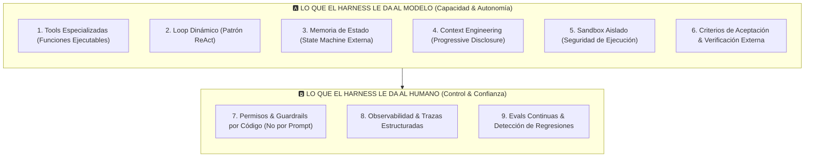

# GUÍA DE HARNESS ENGINEERING: ARQUITECTURA DE SISTEMAS AGÉNTICOS INSTITUCIONALES

> *"Un modelo recibe texto y devuelve texto. Eso es todo lo que hace. No abre archivos, no ejecuta órdenes, no calcula matemáticas en tiempo real ni tiene memoria de estado. Todo lo que no es el modelo, es el **Harness**."*

---

## 1. La Tesis Fundamental: Modelo vs. Harness

Durante mucho tiempo se asumió erróneamente que para mejorar el desempeño de un sistema de Inteligencia Artificial la única solución era cambiar de LLM o refinar el prompt (*Prompt Engineering*). La industria de frontera (Anthropic, OpenAI, LangChain) ha demostrado empíricamente lo contrario:

$$\text{Agente} = \text{Modelo} + \text{Harness}$$

* **El Modelo (Inferencia & Razonamiento):** Actúa como el procesador central (CPU/Cerebro). Es intrínsecamente *stateless* (sin estado), incapaz de interactuar con el mundo físico o digital por sí mismo.
* **El Harness (El Arnés / Sistema Operativo Agéntico):** Es todo el software que rodea al modelo: recopila y filtra el contexto, expone herramientas (*tools*), ejecuta acciones, administra la memoria persistente, impone guardrails de seguridad por código, verifica resultados contra evidencia externa y audita las trazas de ejecución.

Un modelo de menor escala dotado de un **Harness de ingeniería superior** supera consistentemente a un modelo de frontera montado sobre un harness deficiente o improvisado.

---

## 2. Los 9 Bloques Fundamentales de un Harness

Un arnés agéntico de nivel de producción se estructura en **dos dimensiones**: lo que el harness le proporciona al modelo para operar con autonomía, y lo que le proporciona al operador humano para garantizar gobernanza y confianza.

---

### Grupo A: Lo que el Harness le da al Modelo

#### 1. Tools (Herramientas con Errores Informativos)
* Las *tools* son contratos formales de funciones expuestas al LLM (nombre, descripción semántica, schema de parámetros tipados y respuesta devuelta).
* **Regla de Diseño Crítica:** La calidad de la respuesta de error define el éxito del agente. Un error opaco (`{"status": "error"}`) obliga al modelo a alucinar; un error descriptivo con pistas de remediación (`{"status": "rejected", "reason": "Price 2640 exceeds daily ATR range [2645, 2690]"}`) permite corregir el rumbo en el siguiente ciclo.

#### 2. Loop de Ejecución (Ciclo ReAct)
* El modelo no puede planificar todas las acciones a priori porque cada paso depende del resultado empírico del anterior.
* El harness implementa un ciclo: **Razonar $\rightarrow$ Solicitar Tool $\rightarrow$ Ejecutar en el Entorno $\rightarrow$ Observar Resultado $\rightarrow$ Volver a Razonar**, repitiendo hasta satisfacer la condición de parada.

#### 3. Memoria de Estado (Stateless Model + Stateful Harness)
* Cada llamada al LLM es químicamente pura e independiente.
* El harness mantiene la *State Machine* viva: archivos leídos, niveles calculados, llamadas previas, errores acumulados y número de iteraciones. El harness inyecta este resumen ordenado en cada llamada.

#### 4. Context Engineering & Progressive Disclosure
* **Más contexto no es mejor contexto:** Inyectar masividad de datos sin procesar contamina la atención del modelo y dispara la tasa de alucinación (*Lost in the Middle*).
* **Divulgación Progresiva:** El harness entrega primero un mapa/índice sintético del problema. Si el agente requiere profundizar en un módulo o nivel de precios, solicita la herramienta de detalle (*Retrieval* bajo demanda).
* **Compaction:** Cuando la traza de conversación se dilata, el harness compacta eventos antiguos en resúmenes deterministas sin perder decisiones críticas.

#### 5. Sandbox (Entorno de Ejecución Aislado)
* Ejecución controlada que previene tres riesgos críticos:
  1. Comandos destructivos sobre infraestructura de producción.
  2. Fugas de datos no autorizadas a redes externas.
  3. Inyecciones de prompts indirectas (*Indirect Prompt Injection*) provenientes de fuentes web o feeds externos no saneados.

#### 6. Objetivo Explícito & Verificación Externa (Anti-Autocomplacencia)
* Cuando un LLM dice *"Listo, la tarea está resuelta"*, solo expresa lo que él *cree* haber hecho.
* El harness **nunca confía en la palabra del modelo**. El harness exige **evidencia externa determinista**:
  * ¿Compila el código?
  * ¿Pasan los tests unitarios?
  * ¿Coinciden los precios citados con los datos reales del libro de órdenes?
* **Patrón Generator vs. Evaluator:** El agente que genera la hipótesis es auditado por un evaluador independiente con criterios ciegos.

---

### Grupo B: Lo que el Harness le da al Operador

#### 7. Permisos & Guardrails por Código (Principio de Bloqueo Duro)
* **La Regla de Oro:** *Los límites regulatorios y de seguridad deben vivir en el código del sistema de permisos, NUNCA en las instrucciones del system prompt.*
* Un prompt que dice *"no des recomendaciones financieras directas"* puede ser burlado mediante ingeniería de prompt o ambigüedad semántica.
* Un middleware en Python o TypeScript que intercepta el payload y arroja excepción si detecta palabras clave de señal de compra/venta o parámetros de apalancamiento es **inviolable**.
* **Human-in-the-Loop:** Techados de iteraciones, costos y tiempos; ante 3 fallos consecutivos, el harness congela la ejecución y devuelve el control al humano.

#### 8. Observabilidad & Trazas Estructuradas
* En sistemas agénticos, el resultado final no explica el fallo.
* El harness registra la traza cronológica completa:
  * Prompt exacto y contexto enviado.
  * Herramienta seleccionada y parámetros transmitidos.
  * Respuesta cruda del entorno.
  * Punto exacto donde divergió la hipótesis.

#### 9. Evals & Detección de Regresiones
* Modificar un prompt o una tool para resolver un caso complejo puede degradar tareas básicas que antes funcionaban perfectamente.
* Un harness profesional cuenta con una batería fija de pruebas de regresión (*Evals*) que valida el sistema de punta a punta ante cada cambio de versión.

---

## 3. Extensiones de Frontera en Harness Engineering

1. **Skills Modulares:** Paquetes de instrucciones, criterios de validación y recursos específicos que el harness carga dinámicamente solo cuando se activa ese dominio (ej. *Skill de Volatilidad por Noticias*, *Skill de Análisis de Rango dPOC*).
2. **Model Context Protocol (MCP):** Protocolo estandarizado para interconectar herramientas, bases de datos y servicios externos con el harness mediante interfaces interoperables.
3. **Model Routing (Optimización de Latencia y Costos):** Asignación de modelos según la complejidad de la tarea dentro del harness:
   * Modelos ultrarrápidos y económicos (ej. Flash / Groq) para validación de sintaxis, parsing de datos y monitoreo de niveles continuos.
   * Modelos de frontera (ej. Claude 3.5 Sonnet / Gemini Pro) para síntesis macroeconómica profunda, deliberación multi-agente y análisis post-mortem semanal.
4. **Memoria de Largo Plazo:** Almacenamiento persistente entre sesiones que trasciende una sola tarea, reteniendo patrones de comportamiento, sesgos recurrentes del operador y precedentes de mercado.

---

## 4. Mapeo del Harness Engineering en la Arquitectura de AEON

| Pilar del Harness | Implementación Concreta en AEON |
| :--- | :--- |
| **Motor Matemático (Tools)** | Scripts Python en VPS (`aeon_autonomous_engine.py`) calculan VWAP, dPOC, desviaciones $\sigma$, ZAP (Order Blocks) y liquidez BSL/SSL a costo $0. |
| **Orquestador Multi-Agente (Loop)** | `harness_orchestrator.py` y Supabase Edge Functions ejecutan la deliberación entre agentes (Microestructura, Macro, Liquidez, Risk Sentinel). |
| **Anti-Oracle Lock (Guardrails)** | Middlewares deterministas en Python (`AntiOracleLock`) que bloquean cualquier intento de emitir señales predictivas de trading o recomendaciones financieras. |
| **Observabilidad & Diagnóstico** | `post_mortem_engine.py` almacena las trazas de mercado y niveles citados para auditoría y aprendizaje del sistema. |
| **Memoria de Largo Plazo** | **AI Trader Journal:** Registro de operaciones del trader para análisis semanal de disciplina, confluencias respetadas y sesgos psicológicos. |
| **Evals Automatizadas** | Suite unitaria (`tests/test_harness_mas.py`, `tests/test_post_mortem_mas.py`, `tests/test_mas_anti_oracle_and_context.py`) ejecutada en cada build. |
