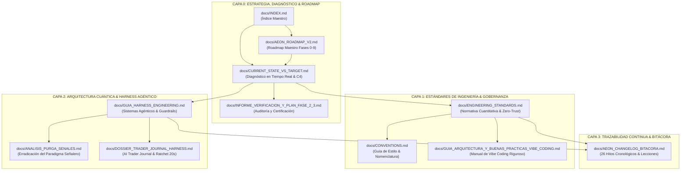

# 🧭 AEON — Índice Maestro y Mapa de Documentación Técnica

**Centro de Gobernanza, Arquitectura y Estándares de Ingeniería Institucional**  
**Versión de la Suite:** 2.2.0 (Certificación de Ingeniería Senior)  
**Entorno de Producción:** MAS v1.3.0 (Multi-Agent System)  
**Última Auditoría Integral:** Septiembre de 2026  

---

> [!NOTE]
> **Infraestructura Soberana de Producción:**
> * **Repositorio Oficial:** [`aeon-core-team/AEON-INTELLIGENCE`](https://github.com/aeon-core-team/AEON-INTELLIGENCE)
> * **Hosting Global:** [Cloudflare Pages](https://aeon-intelligence.pages.dev) (Compilación Vite $< 400\text{ms}$)
> * **Base de Datos:** Supabase PostgreSQL US East (`ueukfjowysadezsmtzto.supabase.co`)
> * **Motor Cuantitativo 24/7:** Daemons asíncronos Python en VPS Linux (`scripts/ai/aeon_autonomous_engine.py`, `harness_sentinel.py`)

---

## 🗺️ 1. Mapa de Navegación del Ecosistema Técnico

El siguiente diagrama visualiza el flujo de lectura, dependencia y capas de responsabilidad entre los documentos normativos y operativos de AEON:

---

## 🏛️ 2. Suite Documental por Capas de Responsabilidad

### A. Estrategia, Estado Operativo y Roadmap

| Documento | Rol / Propósito Primario | Nivel de Madurez | Certificación |
|---|---|:---:|:---:|
| [`AEON_ROADMAP_V2.md`](file:///c:/Users/indatech/Desktop/Proyectos/Fintech/AEON/docs/AEON_ROADMAP_V2.md) | Roadmap maestro de ingeniería por fases continuas (Fases 0 a 9). | `Producción` | **Activo** |
| [`CURRENT_STATE_VS_TARGET.md`](file:///c:/Users/indatech/Desktop/Proyectos/Fintech/AEON/docs/CURRENT_STATE_VS_TARGET.md) | Diagnóstico técnico en tiempo real: estado real del repo vs arquitectura objetivo (Fases 6L/6M), topología C4 N2, secuencia de ingesta y máquinas de estado. | `Producción` | **Normativo (v2.2)** |
| [`INFORME_VERIFICACION_Y_PLAN_FASE_2_3.md`](file:///c:/Users/indatech/Desktop/Proyectos/Fintech/AEON/docs/INFORME_VERIFICACION_Y_PLAN_FASE_2_3.md) | Informe formal de certificación de purga de señales, auditoría de `Aeon_Bot` y plan de ingeniería. | `Cerrado` | **Auditado** |

---

### B. Estándares de Ingeniería, Seguridad & Normativa

| Documento | Rol / Propósito Primario | Nivel de Madurez | Certificación |
|---|---|:---:|:---:|
| [`ENGINEERING_STANDARDS.md`](file:///c:/Users/indatech/Desktop/Proyectos/Fintech/AEON/docs/ENGINEERING_STANDARDS.md) | Estándares cuantitativos obligatorios ($\KaTeX$), calidad de código, arquitectura Zero-Trust, RLS, testing automatizado, backups 3-2-1 y despliegue VPS. | `Estándar Militar` | **Normativo** |
| [`CONVENTIONS.md`](file:///c:/Users/indatech/Desktop/Proyectos/Fintech/AEON/docs/CONVENTIONS.md) | Convenciones estrictas de nomenclatura, tipado, estructura modular en JavaScript, Python y CSS nativo sin dependencias pesadas. | `Institucional` | **Normativo** |
| [`GUIA_ARQUITECTURA_Y_BUENAS_PRACTICAS_VIBE_CODING.md`](file:///c:/Users/indatech/Desktop/Proyectos/Fintech/AEON/docs/GUIA_ARQUITECTURA_Y_BUENAS_PRACTICAS_VIBE_CODING.md) | Manifiesto de ingeniería para desarrollo asistido por IA: prevención de anti-patrones, modularidad y verificación determinista. | `Doctrina` | **Formativo** |

---

### C. Arquitectura Cuántica MAS & Harness Agéntico (Producción v1.3.0)

| Documento | Rol / Propósito Primario | Nivel de Madurez | Certificación |
|---|---|:---:|:---:|
| [`GUIA_HARNESS_ENGINEERING.md`](file:///c:/Users/indatech/Desktop/Proyectos/Fintech/AEON/docs/GUIA_HARNESS_ENGINEERING.md) | Tesis $\text{Agente} = \text{Modelo} + \text{Harness}$. Los 9 bloques de un harness institucional, ciclo ReAct, diagrama ERD Supabase de producción y guardrails deterministas por código. | `Producción` | **Normativo** |
| [`DOSSIER_TRADER_JOURNAL_HARNESS.md`](file:///c:/Users/indatech/Desktop/Proyectos/Fintech/AEON/docs/DOSSIER_TRADER_JOURNAL_HARNESS.md) | Especificación técnica del AI Trader Journal, telemetría atómica, ratchet de 20s en RAM y memoria persistente del Copilot. | `Producción` | **Activo** |
| [`ANALISIS_PURGA_SENALES.md`](file:///c:/Users/indatech/Desktop/Proyectos/Fintech/AEON/docs/ANALISIS_PURGA_SENALES.md) | Auditoría de erradicación definitiva del paradigma señalero y blindaje anti-fuga de red. | `Cerrado` | **Fase 1 Cerrada** |

---

### D. Trazabilidad Histórica, Bitácora & Evolución

| Documento | Rol / Propósito Primario | Nivel de Madurez | Certificación |
|---|---|:---:|:---:|
| [`AEON_CHANGELOG_BITACORA.md`](file:///c:/Users/indatech/Desktop/Proyectos/Fintech/AEON/docs/AEON_CHANGELOG_BITACORA.md) | Registro cronológico vivo de 26 hitos de arquitectura, refactorizaciones críticas resueltas, benchmarks y lecciones aprendidas. | `Vivo` | **Hito 26 (Sept 2026)** |
| [`PROPUESTA_UPGRADE_VISUAL_DOCS_AEON.md`](file:///c:/Users/indatech/Desktop/Proyectos/Fintech/AEON/docs/PROPUESTA_UPGRADE_VISUAL_DOCS_AEON.md) | Propuesta estratégica de enriquecimiento visual, diagramación Mermaid y fórmulas $\KaTeX$ inspirada en la certificación de `Chatbot WS`. | `Planificación` | **En Ejecución** |

---

## 🗄️ 3. Archivo Histórico de Especificaciones (`docs/archive/`)

Los siguientes documentos se mantienen en el archivo histórico exclusivamente con fines de auditoría forense, trazabilidad de decisiones previas y contexto de iteraciones iniciales:

1. `AEON_MASTER_PLAN.md` — Master Plan original v1.0.
2. `AEON_Master_Plan_v2.md` — Documento preliminar de transición a v2.0.
3. `AEON_QUANT_AUDIT.md` — Primera auditoría de algoritmos cuantitativos.
4. `AEON_QUANT_LAB_SPEC.md` — Especificación del laboratorio inicial de backtesting.
5. `AEON_SECURITY_AUDIT.md` — Auditoría de seguridad de despliegue inicial.
6. `AEON_TECHNICAL_AUDIT.md` — Diagnóstico temprano de deuda técnica.
7. `AEON_TECHNICAL_AUDIT_MANDATE.md` — Mandato inicial de estandarización.
8. `AEON_VPS_DEPLOYMENT_GUIDE.md` — Manual de configuración de servidores Linux físicos.
9. `AEON_MARKET_INTELLIGENCE_SPEC.md` — Especificación preliminar de radar contextual.

---

## 🛡️ 4. Principios Innegociables de Ingeniería AEON

> [!IMPORTANT]
> **Las Tres Reglas de Oro del Ecosistema AEON:**
> 1. **Cero Código sin Invariantes Verificados:** Ningún algoritmo cuantitativo o endpoint entra a producción sin pasar por pruebas de fricción real ($WFE \ge 65\%$, deslizamiento y comisiones de Exness Raw).
> 2. **Seguridad Zero-Trust y RLS Obligatorio:** Todo acceso a la base de datos se valida a nivel de fila en Supabase PostgreSQL. Cero tokens de IA o credenciales privilegiadas expuestas en el cliente.
> 3. **Guardrails Deterministas por Código:** El modelo de lenguaje (LLM) nunca ejecuta órdenes de compra/venta ni inventa niveles de precios. El sistema opera bajo el principio *Anti-Oracle Lock* y *Grounding Estricto*.
